## Teil I: Firewall-Konfiguration in pfSense

### Grundkonzept

pfSense verwaltet Firewall-Regeln **interface-basiert** – jede Regel wird auf einem bestimmten Interface (WAN, LAN) definiert und greift für Traffic, der dieses Interface **betritt**. LAN-Regeln gelten also für Traffic von LAN-Clients Richtung Router/WAN, WAN-Regeln für eingehenden Traffic aus dem Internet. Das ist ein konzeptioneller Unterschied zu iptables, wo Regeln auf Chains (INPUT, FORWARD, OUTPUT) arbeiten.

| Konzept        | iptables                         | pfSense                                      |
| -------------- | -------------------------------- | -------------------------------------------- |
| Regelort       | Chain (INPUT/FORWARD)            | Interface (WAN/LAN)                          |
| Default Policy | per Chain explizit gesetzt       | implizites Deny am Ende jeder Regelliste     |
| NAT            | PREROUTING / POSTROUTING         | Firewall → NAT (eigener Bereich)             |
| Reihenfolge    | erste passende Regel greift      | erste passende Regel greift (Top-Down)       |
| Stateful       | conntrack – erfordert explizite ESTABLISHED,RELATED-Regel               | standardmäßig aktiv, transparent im Hintergrund |

Da pfSense standardmäßig stateful ist, müssen keine expliziten Rückrichtungs-Regeln angelegt werden. Die **State Table** speichert aktive Verbindungen und erlaubt automatisch den Rückverkehr – ohne separate Regeln.


---

### Relevante Menüpunkte

Über **Firewall** in der Navigationsleiste sind u.a. folgende Bereiche erreichbar:

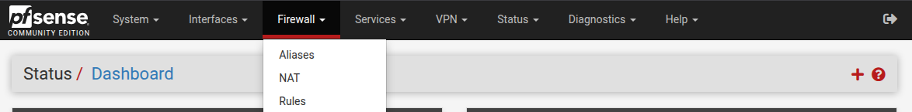

#### Firewall → Rules

Paketfilter-Regeln pro Interface. Die Tabs **WAN** und **LAN** sind für diesen Use Case relevant.

- **WAN**: Regeln für eingehenden Traffic aus dem Internet. Standardmäßig ist nur die Regel *Block bogon networks* aktiv – alle eingehenden Verbindungen sind sonst geblockt.
- **LAN**: Regeln für Traffic aus dem internen Netz. Hier wird definiert, was LAN-Clients dürfen (HTTP, HTTPS, DNS, ICMP).
- **Floating**: Interface-übergreifende Regeln – für diesen Use Case nicht benötigt.

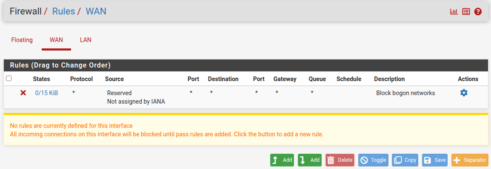
>*Block bogon networks (Source: Reserved / Not assigned by IANA) – blockiert nicht öffentlich geroutete IP-Bereiche. Schutz vor gefälschten Quelladressen.*

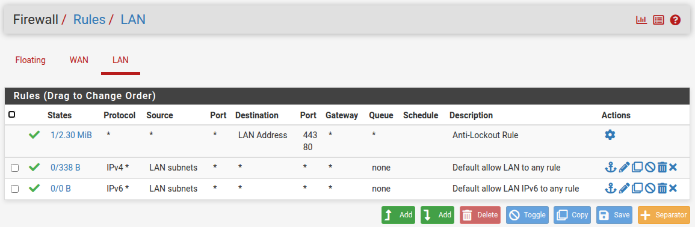
> *Anti-Lockout Rule: Zugriff auf WebConfigurator (80/443) immer erlaubt, kann nicht gelöscht werden. Default allow LAN to any (IPv4+IPv6): permissive Grundregel – erlaubt allen LAN-Clients uneingeschränkten Zugriff.*

#### Firewall → NAT

Adressübersetzung. Zwei Bereiche sind für diesen Use Case relevant:

**Port Forward** – DNAT: Eingehender Traffic auf einen internen Host weiterleiten (hier: RDP → 192.168.10.50).
pfSense legt beim Erstellen einer Port-Forward-Regel automatisch eine passende Filter-Regel an (*Associated Filter Rule*) – diese muss nicht separat erstellt werden.

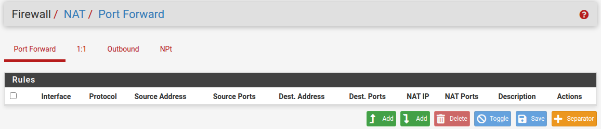

**Outbound** – Masquerading: LAN-Traffic über das WAN-Interface übersetzen.
Standardmäßig ist *Automatic Outbound NAT* aktiv – pfSense führt automatisch Masquerading durch. Keine manuelle Regel nötig.

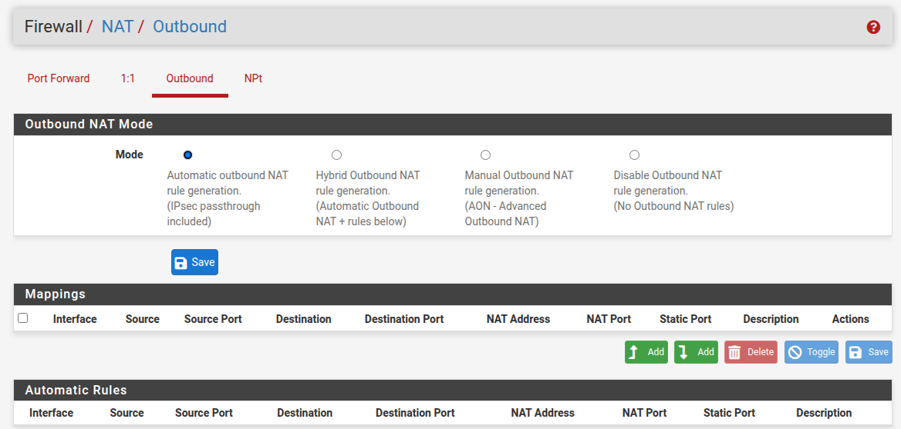

#### Status → System Logs → Firewall

Unter **Status → System Logs** → Tab **Firewall** → **Normal View** sind alle gefilterten Pakete einsehbar.

Spalten: Action (Pass/Block), Time, Interface, Rule, Source, Destination, Protocol.

Geblockte Pakete ohne passende Erlaubnis-Regel erscheinen hier mit der Regel **Default deny rule IPv4/IPv6** – das bestätigt, dass das implizite Deny aktiv ist und greift.

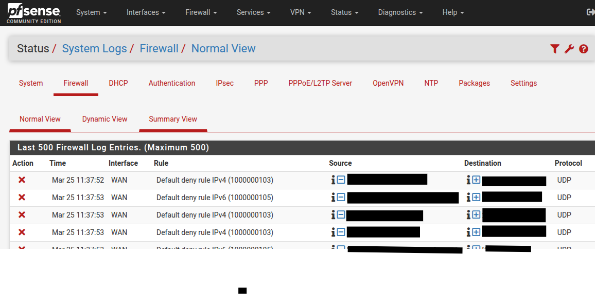

> Alle nicht explizit erlaubten eingehenden Verbindungen auf WAN werden als Default deny rule IPv4/IPv6 geloggt.

Der Screenshot zeigt die *Default deny rule IPv4/IPv6* auf WAN – geblockte Pakete ohne passende Erlaubnis-Regel werden hier sichtbar protokolliert.

---

### Mapping: fw_policy.sh → pfSense

#### Schritt 1 – NAT / Masquerading (LAN → WAN)

**iptables:**
```bash
iptables -t nat -A POSTROUTING -o eth0 -j MASQUERADE
```

**pfSense:**
Firewall → NAT → Outbound → Modus: *Automatic Outbound NAT* – bereits aktiv, keine Aktion nötig.

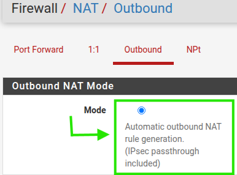

> Outbound NAT im Automatic-Modus – pfSense führt automatisch Masquerading für den gesamten LAN-Traffic über das WAN-Interface durch.
---

#### Schritt 2 – Default-DROP Policy

**iptables:**
```bash
iptables -P INPUT DROP
iptables -P FORWARD DROP
iptables -P OUTPUT ACCEPT
```

**pfSense:**
Das implizite *Deny All* am Ende jeder Interface-Regelliste entspricht funktional einer restriktiven INPUT- und FORWARD-Policy, wird aber in pfSense interface-basiert umgesetzt – keine explizite Konfiguration nötig.

Jedoch sind standardmäßig zwei permissive LAN-Regeln aktiv, die das implizite Deny aufheben:
- *Default allow LAN to any rule* (IPv4)
- *Default allow LAN IPv6 to any rule*

Diese müssen gelöscht werden: Firewall → Rules → LAN → beide Regeln markieren → Delete → **Apply Changes**

> ⚠️ Die *Anti-Lockout Rule* (Port 80/443 auf LAN Address) bleibt bestehen – sie kann nicht gelöscht werden.

Nach dem Löschen erscheint ein gelber Hinweisbalken: *„The firewall rule configuration has been changed. The changes must be applied for them to take effect."* – erst nach Klick auf **Apply Changes** sind die Regeln aktiv entfernt.

> 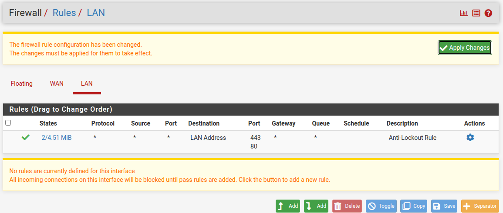
> *LAN-Regelliste nach dem Löschen – nur noch Anti-Lockout Rule, Apply-Changes-Banner sichtbar.*

---


#### Schritt 3 – HTTP / HTTPS erlauben (LAN → WAN)

**iptables:**
```bash
iptables -A FORWARD -i eth1 -o eth0 -p tcp --dport 80 -j ACCEPT
iptables -A FORWARD -i eth1 -o eth0 -p tcp --dport 443 -j ACCEPT
```

**pfSense:**

**Schritt 1:** Firewall → Aliases → Ports → **Add**

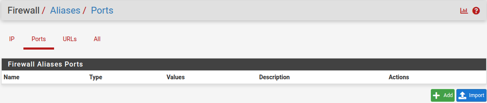 


> **Aliases** sind benannte Gruppen von IPs, Netzwerken oder Ports, die in Regeln wiederverwendet werden können. Statt Ports direkt in einer Regel einzutragen, verweist die Regel auf den Alias – das vermeidet Range-Fehler und hält Regeln lesbar.

Im Formular ausfüllen:

| Feld        | Wert       |
| ----------- | ---------- |
| Name        | HTTP_HTTPS |
| Description | HTTP und HTTPS |
| Type        | Port(s)    |
| Port | 80        |

Dann **+ Add Port** klicken und zweiten Eintrag ergänzen:

| Feld         | Wert |
| ------------ | ---- |
| Port| 443  |

→ **Save** → **Apply Changes**

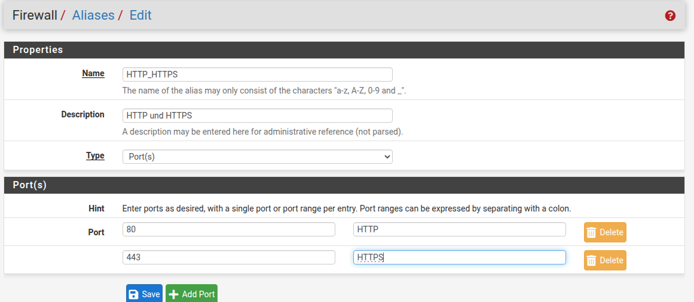 

**Schritt 2:** Firewall → Rules → LAN → **↑ Add**

> Es gibt zwei Add-Buttons: **↑ Add** fügt die Regel oben ein, **↓ Add** unten. Regeln werden Top-Down verarbeitet – ↑ Add stellt sicher, dass die neue Regel an erster Stelle steht.


| Feld                              | Wert                              |
| --------------------------------- | --------------------------------- |
| Action                            | Pass                              |
| Interface                         | LAN                               |
| Address Family                    | IPv4                              |
| Protocol                          | TCP                               |
| Source                            | LAN subnets                       |
| Destination                       | any                               |
| Destination Port Range – From     | HTTP_HTTPS *(Alias per Autocomplete)* |
| Destination Port Range – To       | *(leer lassen)*                   |
| Description                       | *(optional)*                      |

→ **Save** → **Apply Changes**

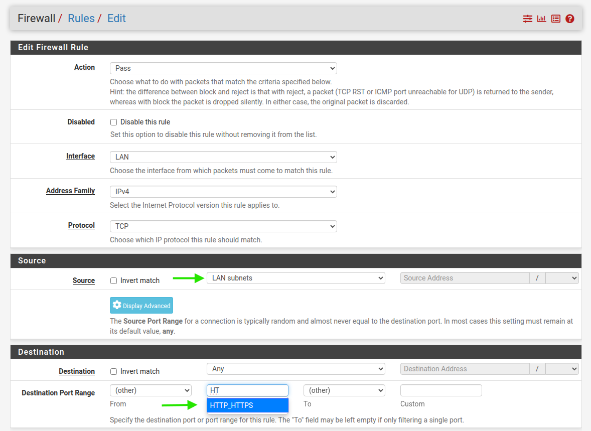

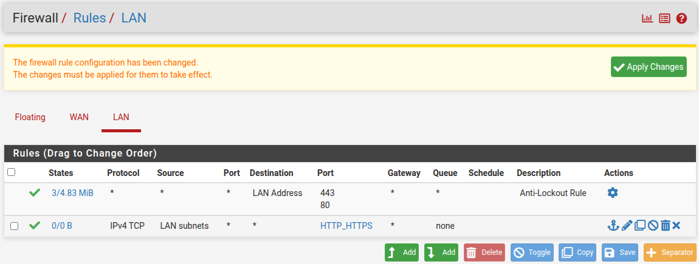

---

#### Schritt 4 – DNS erlauben (LAN → WAN)

**iptables:**
```bash
iptables -A FORWARD -i eth1 -o eth0 -p udp --dport 53 -j ACCEPT
iptables -A FORWARD -i eth1 -o eth0 -p tcp --dport 53 -j ACCEPT
```

**pfSense:**
Firewall → Rules → LAN → **↑ Add**

| Feld                          | Wert                 |
| ----------------------------- | -------------------- |
| Action                        | Pass                 |
| Interface                     | LAN                  |
| Address Family                | IPv4                 |
| Protocol                      | TCP/UDP              |
| Source                        | LAN subnets          |
| Destination                   | any                  |
| Destination Port Range – From | DNS (53)             |
| Destination Port Range – To   | DNS (53)             |
| Description                   | Allow DNS LAN to WAN |

→ **Save** → **Apply Changes**

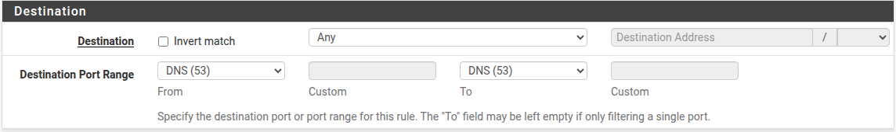

---

#### Schritt 5 – ICMP (Ping) erlauben

**iptables:**
```bash
iptables -A FORWARD -p icmp --icmp-type echo-request -j ACCEPT
iptables -A INPUT -p icmp -j ACCEPT
```

**pfSense:**
Firewall → Rules → LAN → **↑ Add**

| Feld           | Wert                |
| -------------- | ------------------- |
| Action         | Pass                |
| Interface      | LAN                 |
| Address Family | IPv4                |
| Protocol       | ICMP                |
| ICMP Subtypes  | Echo request        |
| Source         | LAN subnets         |
| Destination    | any                 |
| Description    | Allow ICMP Echo LAN |

→ **Save** → **Apply Changes**

> Restriktiver als `any` – entspricht exakt dem iptables `--icmp-type echo-request`. Für Diagnosezwecke ausreichend.

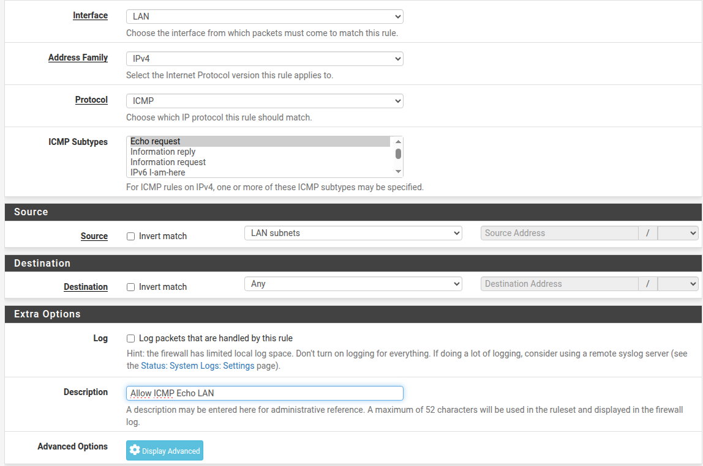

---

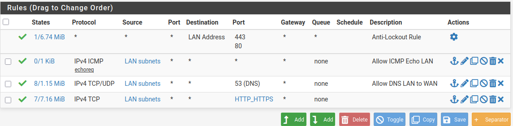

> *Finaler Stand der LAN-Regelliste: Anti-Lockout Rule, ICMP Echo, DNS und HTTP_HTTPS aktiv.*

#### Schritt 6 – RDP-Portforward → 192.168.10.50

Äquivalente iptables:
```bash
iptables -t nat -A PREROUTING -p tcp --dport 3389 -j DNAT --to-destination 192.168.10.50:3389
iptables -A FORWARD -p tcp -d 192.168.10.50 --dport 3389 -j ACCEPT
```

**pfSense:**
Firewall → NAT → Port Forward → **↑ Add**

| Feld                                    | Wert                  |
| --------------------------------------- | --------------------- |
| Interface                               | WAN                   |
| Address Family                          | IPv4                  |
| Protocol                                | TCP                   |
| Destination – Type                      | WAN address           |
| Destination port range – From port      | 3389                  |
| Destination port range – To port        | *(leer)*              |
| Redirect target IP – Type               | Address or Alias      |
| Redirect target IP – Address            | 192.168.10.50         |
| Redirect target port                    | 3389                  |
| Filter rule association                 | Add associated filter rule |

→ **Save** → **Apply Changes**

Die zugehörige Filter-Regel wird von pfSense automatisch angelegt.

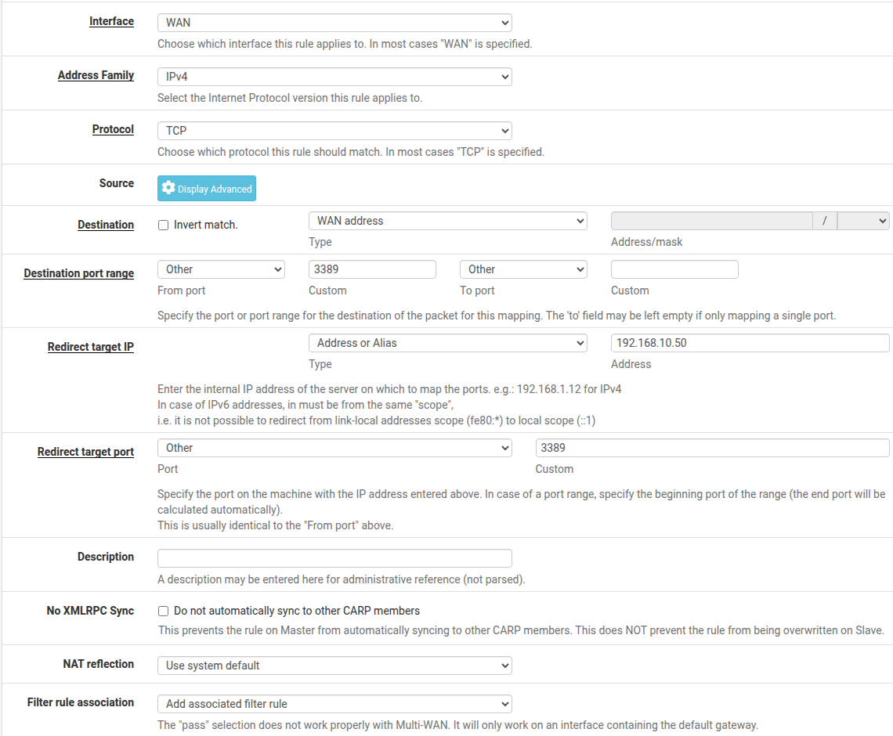


### 6.1 – XFCE und xrdp installieren
 
```bash
sudo apt install -y xrdp xfce4 xfce4-goodies
```
 
> `xrdp` allein liefert keinen Desktop. Ohne Desktop-Umgebung zeigt jede RDP-Verbindung nur einen schwarzen Bildschirm. <y>
 
### 6.2 – XFCE als Session festlegen
 
```bash
echo xfce4-session > ~/.xsession
chmod +x ~/.xsession
```
 
 
### 6.3 – Zugriff auf RDP-Benutzer einschränken
 
```bash
sudo groupadd rdpusers
sudo usermod -aG rdpusers student
```
 
```bash
sudo nano /etc/xrdp/sesman.ini
```
 
```ini
TerminalServerUsers=rdpusers
```
 
> Nur Benutzer in der Gruppe `rdpusers` können sich per RDP anmelden.
 
### 6.4 – xrdp Zugriff auf SSL-Zertifikat erlauben
 
```bash
sudo adduser xrdp ssl-cert
```
 
### 6.5 – Session-Auflösung in `startwm.sh` anpassen
 
```bash
sudo nano /etc/xrdp/startwm.sh
```
 
Die letzten Zeilen ersetzen durch:
 
```bash
# User-defined session
if [ -r ~/.xsession ]; then
  exec ~/.xsession
fi
 
# XFCE fallback
if command -v xfce4-session >/dev/null 2>&1; then
  exec xfce4-session
fi
 
# Default fallback
test -x /etc/X11/Xsession && exec /etc/X11/Xsession
exec /bin/sh /etc/X11/Xsession
```
 
### 6.6 – xrdp aktivieren und starten
 
```bash
sudo systemctl enable xrdp
sudo systemctl restart xrdp
sudo systemctl status xrdp
```
 
Erwartung: `Active: active (running)`


### 7.7 – RDP zum Admin-Client

Auf dem Hyper-V-Manager **pfsense router** markieren, sodass im unteren Panel die zum **R-LAB_Internet** zugeordnete IP-Adresse sichtbar wird.

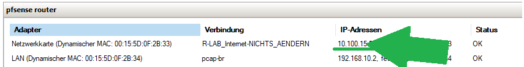

WAN-IP ermitteln.

```bash
mstsc /v:10.100.xx.xx
```

Anmeldung mit `student`.


---

---

**Regelpersistenz:**
Alle Regeländerungen werden automatisch in der internen Konfiguration gespeichert und überleben jeden Neustart ohne weiteres Zutun. D.h. keine äquivalenter Schritt zu iptables-persistent notwendig.

---
