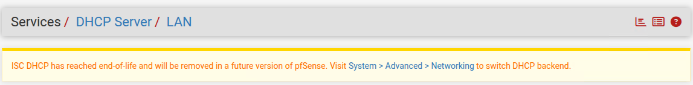
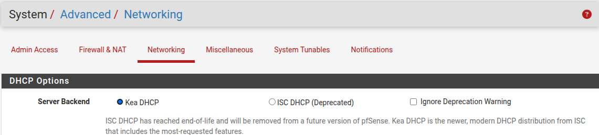
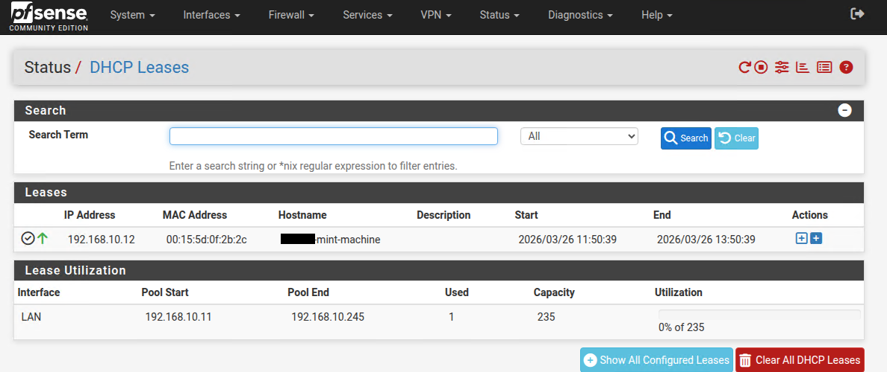
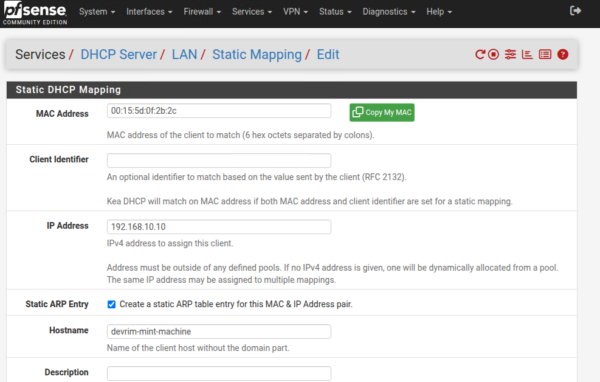
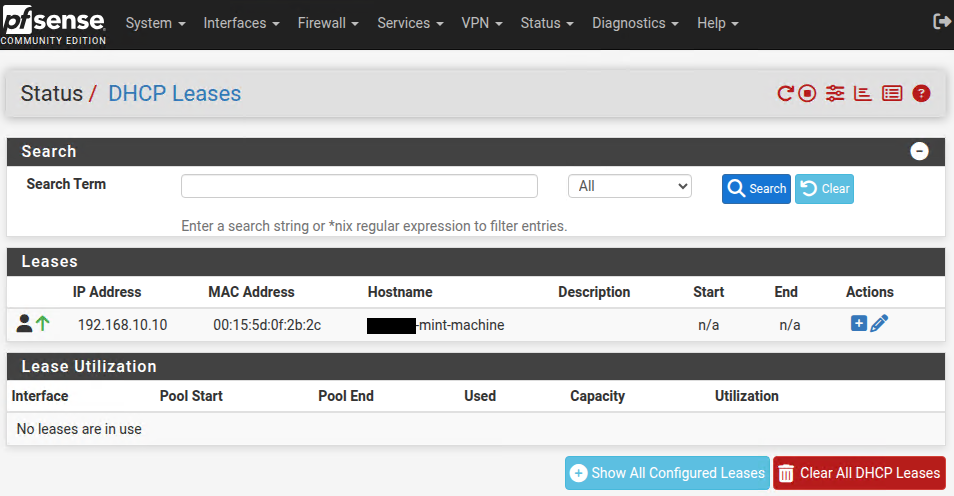
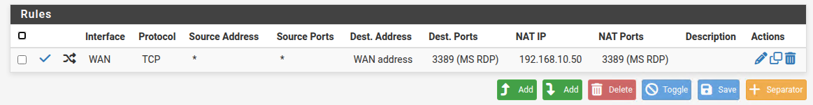
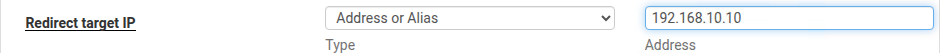

## Teil II: DHCP-Server in pfSense

### Backend-Wahl: Kea DHCP

Ab pfSense 2.8.x ist **Kea DHCP** der neue Standard-Backend. ISC DHCP gilt als deprecated und wird in einer zukünftigen Version entfernt. Das Backend wird unter **System → Advanced → Networking → DHCP Options → Server Backend** gewählt.






Da im Lab auf **pfSense 2.8.1** aktualisiert wurde und Kea DHCP bereits aus LF10B (SRV1) bekannt ist, wird Kea als Backend verwendet – konsistent zum bisherigen Stack.

---

### Grundkonzept

| Konzept            | kea-dhcp4 (LF10B – SRV1)                   | Kea DHCP (pfSense 2.8.x)                |
| ------------------ | ------------------------------------------- | ---------------------------------------- |
| Konfiguration      | /etc/kea/kea-dhcp4.conf (JSON)              | Services → DHCP Server (WebGUI)          |
| Interface-Bindung  | `"interfaces-config"` → `"ens18"`          | pro Interface konfigurierbar (Tab LAN)   |
| Adresspool         | `"pools"` → `"pool"`                       | Range: From / To                         |
| Lease-Zeit         | `"valid-lifetime"` / `"max-valid-lifetime"` | Default / Max Lease Time                 |
| Gateway-Option     | `"option-data"` → `"routers"`              | Gateway                                  |
| DNS-Option         | `"option-data"` → `"domain-name-servers"`  | DNS Servers                              |
| Domäne             | `"option-data"` → `"domain-name"`          | Domain Name                              |
| Statische Einträge | `"reservations"`                            | Services → DHCP Server → Static Mappings |

---

### Mapping: kea-dhcp4.conf → pfSense (Kea DHCP)

#### 1. Interface-Bindung

**kea-dhcp4:**
```json
"interfaces-config": {
  "interfaces": [ "ens18" ]
}
```

**pfSense:**
Services → DHCP Server → Tab **LAN** – die Bindung ans LAN-Interface erfolgt automatisch durch die Tab-Auswahl.

☑ **Enable DHCP server on LAN interface** – muss aktiviert werden, sonst bleibt der Server inaktiv.

---

#### 2. Adresspool

**kea-dhcp4:**
```json
"pools": [
  { "pool": "192.168.10.11 - 192.168.10.245" }
]
```

**pfSense:**
Services → DHCP Server → LAN

| Feld         | Wert           |
| ------------ | -------------- |
| Range – From | 192.168.10.11  |
| Range – To   | 192.168.10.245 |

---

#### 3. Lease-Zeit

**kea-dhcp4:**
```json
"valid-lifetime": 600,
"max-valid-lifetime": 7200
```

**pfSense:**

| Feld               | Wert  |
| ------------------ | ----- |
| Default Lease Time | 600   |
| Max Lease Time     | 7200  |

---

#### 4. Gateway

**kea-dhcp4:**
```json
{ "name": "routers", "data": "192.168.10.2" }
```

**pfSense:**

| Feld    | Wert         |
| ------- | ------------ |
| Gateway | 192.168.10.2 |

> pfSense selbst (`192.168.10.2`) ist das Gateway – anders als in LF10B, wo der Debian-Router auf `.1` lag.

---

#### 5. DNS-Server

**kea-dhcp4:**
```json
{ "name": "domain-name-servers", "data": "192.168.10.2" }
```

**pfSense:**

| Feld        | Wert          |
| ----------- | ------------- |
| DNS Servers | 192.168.10.2  |

> pfSense übernimmt DNS-Forwarding direkt – Clients erhalten `.2` als DNS-Server, nicht mehr SRV1 (`192.168.10.11`).

---

#### 6. Domäne

**kea-dhcp4:**
```json
{ "name": "domain-name", "data": "example.internal" }
```

**pfSense:**

| Feld        | Wert             |
| ----------- | ---------------- |
| Domain Name | example.internal |

→ **Save**

---

### Funktionsnachweis

Unter **Status → DHCP Leases** ist der aktive Lease einsehbar.



>mint-machine` erhielt `192.168.10.12` aus dem Pool `.11–.245`. Lease-Utilization: 1 von 235.

---

### Statische Zuweisungen

Nach der ersten DHCP-Zuweisung erhieltmint-machine` dynamisch `192.168.10.12`. Da der RDP-Portforward eine feste IP erfordert, wird eine statische Zuweisung angelegt.

**Schritt 1:** Beim Lease auf **+** klicken – pfSense übernimmt MAC-Adresse und Hostname automatisch ins Static-Mapping-Formular.



**Schritt 2:** IP-Adresse außerhalb des Pools eintragen. Da der Pool `192.168.10.11–192.168.10.245` ist, wird eine IP aus außerhalb des Pools (unterhalb von .11) gewählt: .10 – wird nicht dynamisch vergeben und deshalb gewählt: **`192.168.10.10`**

☑ **Create a static ARP table entry for this MAC & IP Address pair** – aktivieren.

→ **Save**

Auf dem Host (mint-machine):
````bash
sudo dhclient -r && sudo dhclient
````
Rückversichern:


Gebenenfalls **Clear All DHCP Leases** klicken und dann unter **Diagnostics -> ARP Table** den veraltenten Eintrag manuell entfernen.

**Schritt 3:** Da sich die Client-IP geändert hat, muss der RDP-Portforward angepasst werden:

Firewall → NAT → Port Forward → Regel bearbeiten → **Redirect target IP: `192.168.10.10`**





→ **Save** → **Apply Changes**

---
