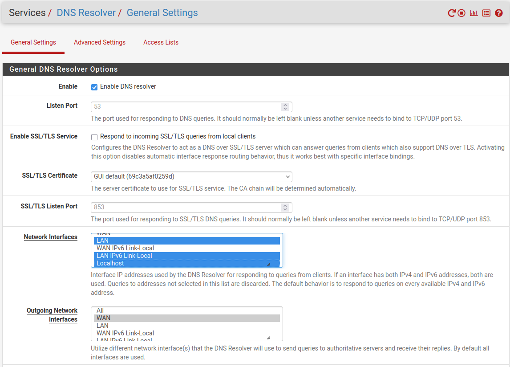
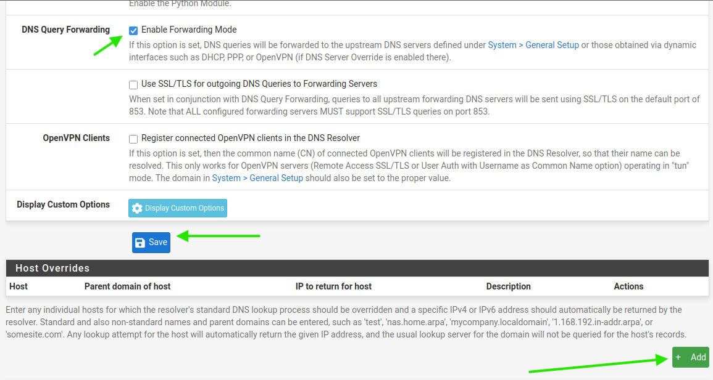
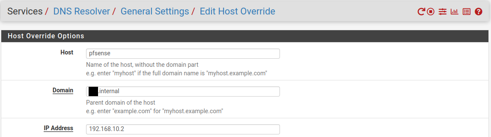
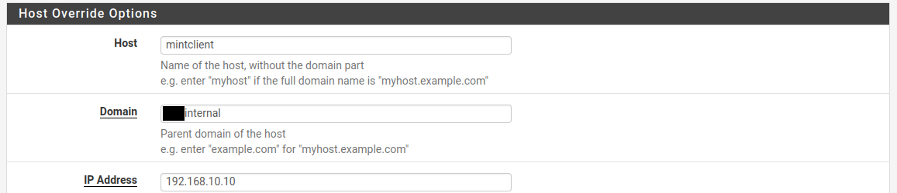
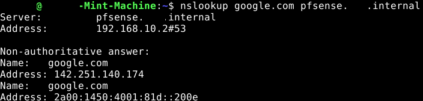

## Teil III: DNS in pfSense

### Grundkonzept

In LF10B übernahm **bind9** auf SRV1 (192.168.10.11) die DNS-Auflösung für `example.internal`. Da SRV1 abgeschaltet wird, übernimmt pfSense diese Rolle vollständig über den integrierten **DNS Resolver (Unbound)**.

Unbound ist ein rekursiver, validierender DNS-Resolver. Interne Hostnamen werden über **Host Overrides** gepflegt – das funktionale Äquivalent zu den A-Records in der bind9-Zonendatei `db.example.internal`.

| Konzept           | bind9 (LF10B – SRV1)                              | DNS Resolver / Unbound (pfSense)         |
| ----------------- | ------------------------------------------------- | ---------------------------------------- |
| Konfiguration     | /etc/bind/named.conf + Zonendateien               | Services → DNS Resolver (WebGUI)         |
| Interne Zone      | zone `example.internal` → db.example.internal             | Host Overrides                           |
| A-Records         | Einträge in Zonendatei                            | Services → DNS Resolver → Host Overrides |
| Forwarding        | `forwarders { 1.1.1.1; 8.8.8.8; };`  | DNS Resolver → Forwarding Mode           |
| Interface-Bindung | `listen-on { 192.168.10.11; };`                   | Network Interfaces                       |

---

### Schritt 1 – DNS Resolver aktivieren und konfigurieren

**Services → DNS Resolver → General Settings**

#### 1.1 Resolver aktivieren

| Feld   | Wert                    |
| ------ | ----------------------- |
| Enable | ☑ Enable DNS Resolver   |

#### 1.2 Network Interfaces

Hier wird festgelegt, auf welchen Interfaces Unbound auf DNS-Anfragen **lauscht** (eingehend).

**Strg + Klick** (Windows/Linux) bzw. **Cmd + Klick** (macOS) ermöglicht Mehrfachauswahl:

| Auswahl              | Begründung                                                                 |
| -------------------- | -------------------------------------------------------------------------- |
| `LAN`                | Das interne Netz – hier kommen die Anfragen der Clients an                 |
| `LAN IPv6 Link-Local`| IPv6 ist geplant – dieser Eintrag stellt sicher, dass Unbound auch IPv6-Anfragen über LAN beantwortet |
| `Localhost`          | pfSense selbst nutzt den eigenen Resolver – ohne Localhost würden interne pfSense-Prozesse keinen DNS bekommen |

> **Warum nicht `WAN`?** DNS-Anfragen von außen sollen nicht beantwortet werden. Firewall-Regeln blockieren das zwar ohnehin, aber explizite Interface-Bindung ist sauberer.

#### 1.3 Outgoing Network Interfaces

Hier wird festgelegt, über welches Interface Unbound Anfragen **nach außen** stellt (ausgehend, z. B. an 10.100.0.1).

| Auswahl | Begründung                                      |
| ------- | ----------------------------------------------- |
| `WAN`   | Verbindung ins Schulnetz / Internet läuft über WAN |

→ **Save → Apply Changes**



---

### Schritt 2 – Forwarding Mode aktivieren

Weiter unten auf derselben Seite (nach unten scrollen):

| Feld                  | Wert                    |
| --------------------- | ----------------------- |
| Enable Forwarding Mode | ☑ aktivieren           |

**Was bewirkt Forwarding Mode?**

Ohne Forwarding Mode würde Unbound externe Namen direkt über die Root-Server auflösen – das erfordert volle Internet-Konnektivität. Im Schulnetz steht ein vorgelagerter DNS (10.100.0.1) bereit. Mit Forwarding Mode verhält sich Unbound exakt wie bind9 in LF10B:

```
# bind9 (LF10B) – zum Vergleich
forwarders {
    10.100.0.1;
    1.1.1.1;
    8.8.8.8;
};
```

Die Upstream-Server sind unter **System → General Setup → DNS Servers** bereits eingetragen. Unbound übernimmt diese automatisch.

→ **Save → Apply Changes**



---

### Schritt 3 – Host Overrides anlegen

**Services → DNS Resolver → Host Overrides → + Add**

Ein Host Override besteht aus genau drei Pflichtfeldern:

| Feld        | Bedeutung                                             |
| ----------- | ----------------------------------------------------- |
| Host        | Der Hostname **ohne** Domain (nur der linke Teil)     |
| Domain      | Die interne Domain – immer `example.internal`             |
| IP Address  | Die IPv4- oder IPv6-Adresse, die zurückgeliefert wird |
| Description | Freitext, nur zur eigenen Orientierung (optional)     |

> **Beispiel:** Für `pfsense.example.internal → 192.168.10.2` trägt man ein:
> - Host: `pfsense`
> - Domain: `example.internal`
> - IP Address: `192.168.10.2`



#### Einzutragende Hosts

| Host      | Domain         | IP Address      | Description                        |
| --------- | -------------- | --------------- | ---------------------------------- |
| `pfsense` | `example.internal` | `192.168.10.2`  | pfSense – Router, Gateway, DNS     |
| `client`  | `example.internal` | `192.168.10.10` | mint-machine (statisch .10) |

**Ablauf:**
1. `+ Add`
2. Felder ausfüllen (Tabelle oben)
3. `Save`
4. Zweiten Eintrag ebenso anlegen
5. Nach beiden Einträgen → **Apply Changes**

> Sobald weitere Dienste hinzukommen (Proxmox, NAS etc.), werden hier entsprechende Einträge ergänzt.



---

### Schritt 4 – Funktionsnachweis

Vom Client (`mint-machine`, 192.168.10.10) Terminal öffnen und testen:

```bash
nslookup pfsense.example.internal
nslookup client.example.internal
```

Erwartete Ausgabe (Beispiel für `pfsense.example.internal`):
```
Server:         192.168.10.2
Address:        192.168.10.2#53

Name:   pfsense.example.internal
Address: 192.168.10.2
```

Der **Server** in der Ausgabe muss `192.168.10.2` sein – das beweist, dass der Client pfSense als DNS-Server nutzt (nicht mehr SRV1).


```bash
$ nslookup googel.com pfsense.example.internal
```



> nslookup google.com pfsense.example.internal verfiziert zwei unabhängige DNS-Funktionen in einem Kommando: Zuerst muss nslookup den Servernamen pfsense.example.internal selbst auflösen – dafür muss der Host Override zwingend korrekt eingetragen sein. Schlägt das fehl, schlägt das gesamte Kommando fehl. Erst dann fragt es diesen Server nach google.com – Forwarding muss funktionieren. Die Ausgabe zeigt beide Ergebnisse explizit: den aufgelösten Servernamen und die externe Antwort..

---
