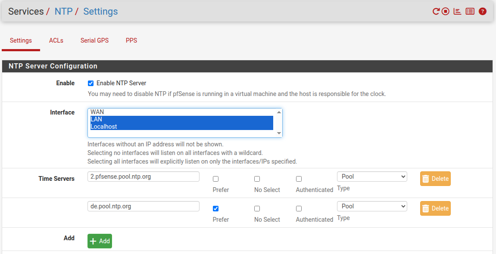
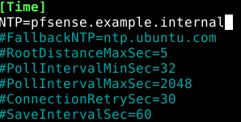
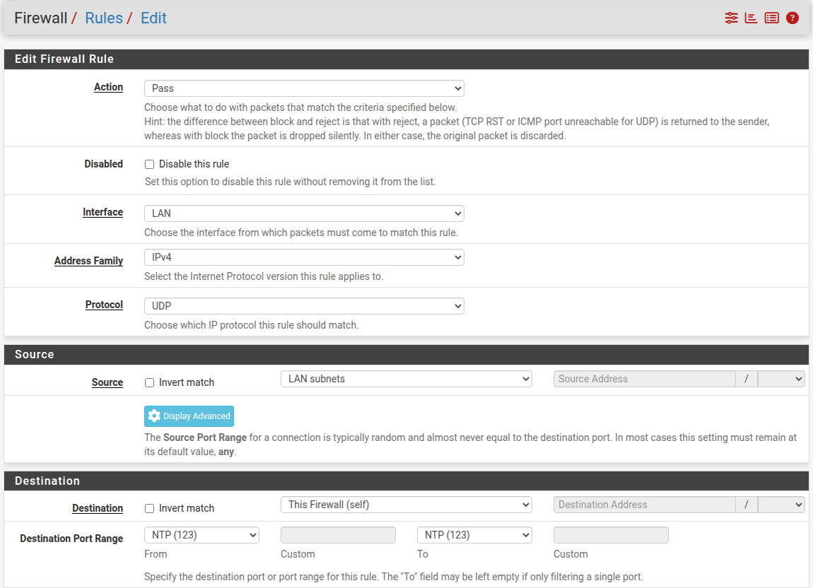
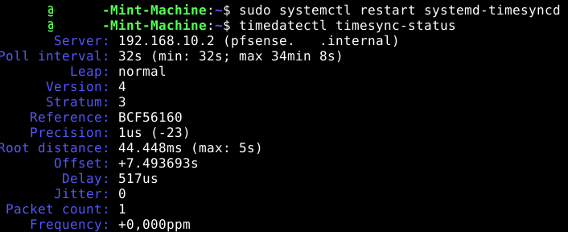
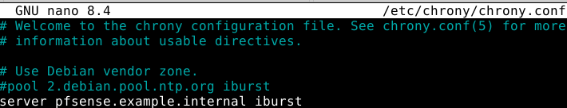
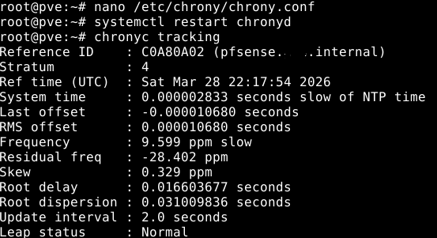
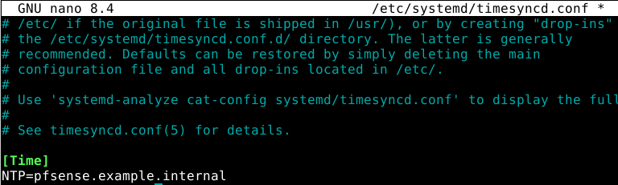
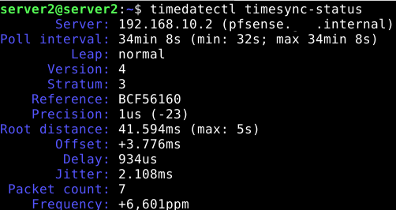
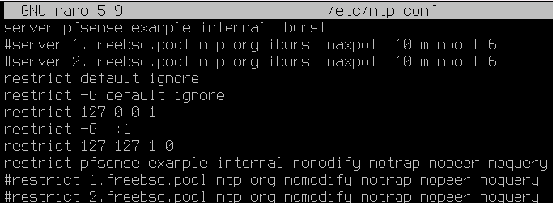
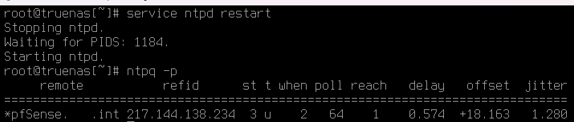

## Teil V: NTP – Chrony ablösen durch pfSense

### Schritt 1 – Chrony auf SRV2 abschalten

pfSense übernimmt NTP nativ – der Chrony-Container auf SRV2 wird nicht mehr benötigt.

Laufende Container prüfen:

```bash
docker ps
```

```
a4027a63fb6b   cturra/ntp:latest               "/bin/sh /opt/startu…"   2 weeks ago   Up 23 hours (healthy)                                                                                                        chrony
098457c0fdfa   cturra/ntp                      "/bin/sh /opt/startu…"   2 weeks ago   Up 23 hours (healthy)   0.0.0.0:123->123/udp, [::]:123->123/udp                                                              ntp
```

Zwei Instanzen sind hier erwartet: In LF10Bv2 wurde der NTP-Container zunächst manuell per `docker run` als `ntp` gestartet, anschließend per `docker-compose.yml` als `chrony` neu aufgesetzt. Der alte `ntp`-Container wurde dabei zwar gestoppt, aber nicht entfernt – er ist zwischenzeitlich wieder hochgekommen. Aktiver NTP-Server ist `ntp` (Port 123 gemappt), `chrony` läuft ohne Port-Binding im Leerlauf.

Beide Container stoppen und entfernen:

```bash
docker stop ntp chrony
docker rm ntp chrony
```

Beide Instanzen sind damit entfernt.

---

### Schritt 2 – NTP auf pfSense aktivieren

**Services → NTP → Settings**

| Feld | Wert |
| --- | --- |
| Enable | ☑ Enable NTP Server |
| Interface | LAN, Localhost |
| Time Servers | `2.pfsense.pool.ntp.org`, `de.pool.ntp.org` (Prefer) |

→ **Save**



---

### Schritt 3 – Client konfigurieren

Auf dem Admin-Client (`mint-machine`) synchronisiert `systemd-timesyncd` die Zeit. Zunächst prüfen:

```bash
timedatectl timesync-status
```

```
Server: 2620:2d:4000:1::41 (ntp.ubuntu.com)
Poll interval: 34min 8s (min: 32s; max 34min 8s)
Packet count: 0
```

Der Client fragt noch den Ubuntu-Fallback-Server. `timesyncd.conf` anpassen:

```bash
sudo nano /etc/systemd/timesyncd.conf
```

`NTP=` entkommentieren und pfSense eintragen:

```ini
[Time]
NTP=pfsense.example.internal
#FallbackNTP=ntp.ubuntu.com
#RootDistanceMaxSec=5
#PollIntervalMinSec=32
#PollIntervalMaxSec=2048
#ConnectionRetrySec=30
#SaveIntervalSec=60
```



```bash
sudo systemctl restart systemd-timesyncd
timedatectl timesync-status
```

```
Server: 192.168.10.2 (pfsense.example.internal)
Poll interval: 32s (min: 32s; max 34min 8s)
Packet count: 0
```

`Packet count: 0` zeigt, dass der Client pfSense zwar als Ziel kennt, aber keine Antwort erhält. Ursache: Die LAN-Firewall lässt NTP-Traffic an pfSense selbst noch nicht durch.

---

### Schritt 4 – Firewall-Regel für NTP anlegen

**Firewall → Rules → LAN → ↑ Add**

| Feld | Wert |
| --- | --- |
| Action | Pass |
| Interface | LAN |
| Address Family | IPv4 |
| Protocol | UDP |
| Source | LAN subnets |
| Destination | This Firewall (self) |
| Destination Port Range | NTP (123) |

→ **Save** → **Apply Changes**



> `This Firewall (self)` begrenzt die Regel auf Traffic, der pfSense selbst als Endpunkt adressiert – nicht einen Host dahinter. `any` würde auch NTP-Traffic zu anderen Zielen durchlassen.
---

### Schritt 5 – Funktionsnachweis

```bash
sudo systemctl restart systemd-timesyncd
timedatectl timesync-status
```

```
       Server: 192.168.10.2 (pfsense.example.internal)
Poll interval: 32s (min: 32s; max 34min 8s)
         Leap: normal
      Version: 4
      Stratum: 3
    Reference: BCF56160
    Precision: 1us (-23)
 Root distance: 44.448ms (max: 5s)
       Offset: +7.493693s
        Delay: 517us
        Jitter: 0
 Packet count: 1
    Frequency: +0,000ppm
```



`Packet count: 1` und `Server: 192.168.10.2` bestätigen: der Client synchronisiert die Zeit erfolgreich über pfSense.
> Der Wert für `Offset: +7.493693s` wirkt erstmal ungewöhnlich hoch (beim ersten Sync normal) und sollte nach kurzer Zeit sich auf viel niedrigere Werte wie `Offset: +39us` einpegeln 

---

### Schritt 6 – NTP-Validierung auf allen VMs

Alle verbleibenden Systeme werden auf pfSense als NTP-Quelle umgestellt und validiert.

#### Proxmox

```bash
nano /etc/chrony/chrony.conf
```
Auskommentieren:
```
pool 2.debian.pool.ntp.org.iburst
```

Eintragen:

```
server pfsense.example.internal iburst
```




```bash
systemctl restart chronyd
chronyc tracking
```



---

#### SRV2

```bash
nano /etc/systemd/timesyncd.conf   
```

> NTP= auskommementiren und pfsense.example.internal eintragen
```
timedatectl timesync-status
```



---

#### TrueNAS

```bash
nano /etc/ntp.conf
```


> Unter Beibehaltung der TrueNAS-Standardvorgaben (restrict default ignore) wurden lediglich die FreeBSD-Server durch pfsense.example.internal ersetzt. Die restrict-Regel erlaubt diesem Host den Zeitabgleich, schließt aber administrative Eingriffe über nomodify und noquery aus. Lokale Standard-Referenzen auf 127.0.0.1 und die Systemuhr bleiben als Fallback aktiv, während die alten Pool-Einträge deaktiviert sind. 


```bash
service ntpd restart
ntpq -p
```



```
     remote           refid      st t when poll reach   delay   offset  jitter
=============================================================================
*pfSense.  .int  217.144.138.234  3 u    2   64    1   0.574  +18.163   1.280
```


`*` vor `pfSense` bestätigt: TrueNAS synchronisiert aktiv über pfSense.
