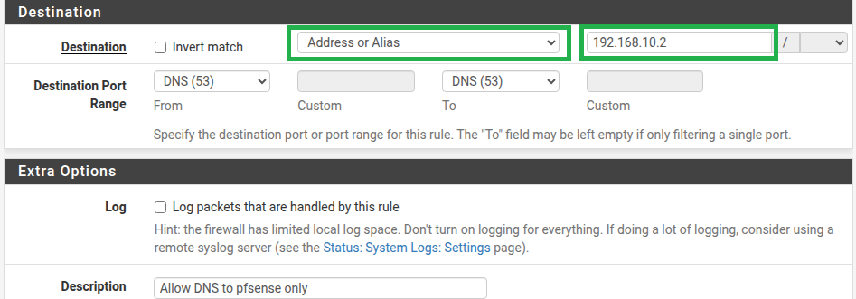
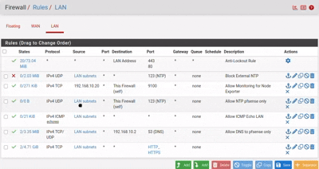
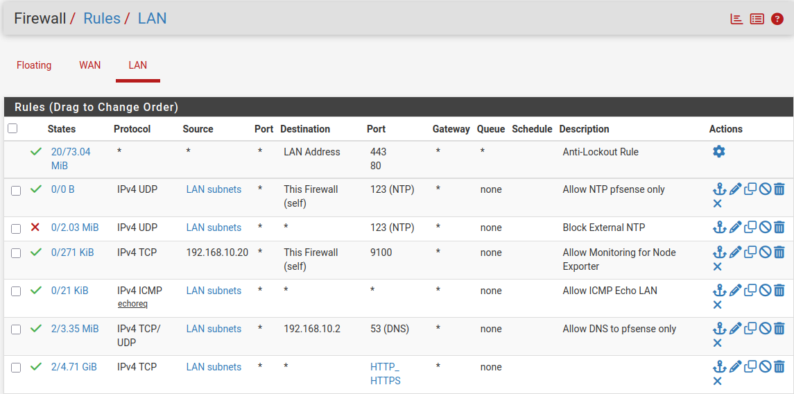
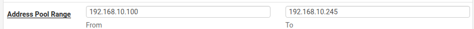
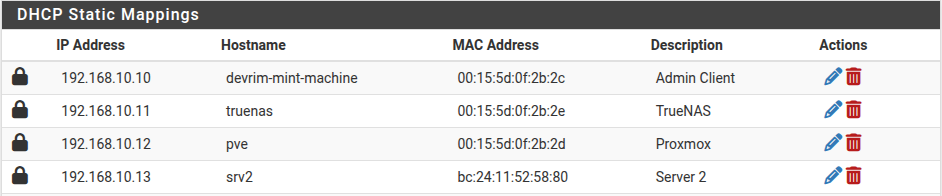
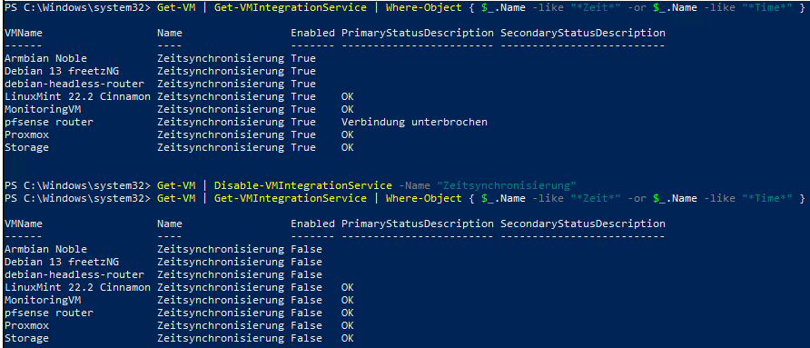
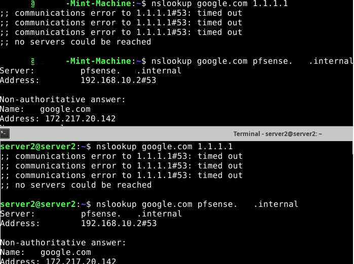
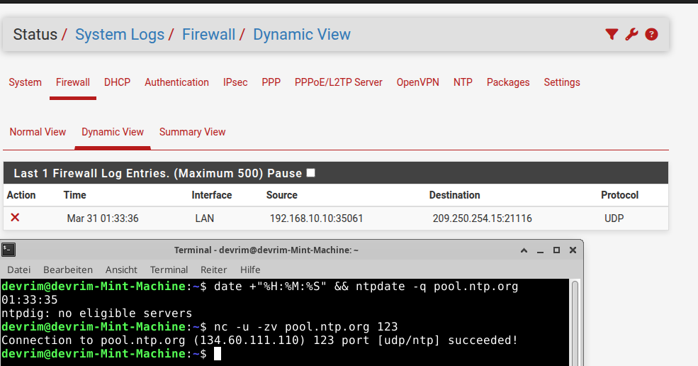

## Teil VI: Hardening – Infrastructure Enforcement Policy

### Grundkonzept

Die bisherigen Kapitel haben die Infrastruktur funktional aufgebaut: pfSense übernimmt Gateway, Firewall, DHCP, DNS und NTP. Die einzelnen Dienste funktionieren – aber sie sind noch nicht gegeneinander abgesichert. Ein Client könnte weiterhin einen externen DNS-Server ansprechen, die Zeit von einem beliebigen NTP-Host beziehen oder eine manuell gesetzte IP nutzen, ohne dass pfSense davon weiß.

Hardening bedeutet hier nicht Absicherung gegen externe Angreifer, sondern **Enforcement der eigenen Architekturentscheidungen**: pfSense ist die einzige autorisierte Quelle für IP-Adressen, DNS und NTP. Abweichungen davon machen die Umgebung nicht reproduzierbar – und nicht reproduzierbare Umgebungen liefern keine verwertbaren Testergebnisse.

Die folgenden Schritte schließen diese Lücken gezielt: bestehende Firewall-Regeln werden eingeschränkt, neue Regeln ergänzt, Hyper-V Time Sync deaktiviert und Alerts konfiguriert. Alle aktiven Systeme werden konsequent in die Policy einbezogen. Die spätere Stilllegung von Proxmox und TrueNAS stellt keinen Widerspruch dar, sondern ist eine Folge der einheitlichen Behandlung aller Systeme und Teil der methodischen Vorgehensweise – keine Fehlinvestition.

---

### Policy

**Scope:** Alle Systeme (VMs, Container) im Lab.

#### 1 – Source of Truth

pfSense ist die einzig autorisierte Quelle für:

- IP-Adressen (DHCP & Static Mapping)
- DNS-Auflösung
- NTP-Zeit

#### 2 – IP-Adressierung

IP-Adressen werden zentral über pfSense verwaltet – entweder per DHCP oder per Static Mapping (DHCP-reserviert). Manuelle IP-Konfiguration im OS ist nicht erlaubt, außer für Recovery- oder Debug-Zwecke.

#### 3 – DNS

- Alle Systeme verwenden ausschließlich pfSense (`192.168.10.2`) als DNS.
- Externe DNS-Adressen sind blockiert.

#### 4 – NTP

- Zeit wird ausschließlich über pfSense synchronisiert.
- Hyper-V Time Sync muss auf allen VMs deaktiviert sein.

#### 5 – Compliance Enforcement

Verstöße führen zu:

- Blockiertem Netzwerkzugriff
- Logging & Alerts in pfSense

#### 6 – Ziel

Vollständig reproduzierbare, zentrale Testumgebung. Deterministische Bug-Tests möglich.

---

### Schritt 1 – Firewall-Regeln anlegen und bearbeiten

**Firewall → Rules → LAN**

#### Regel 1 – Bestehende DNS-Regel einschränken

Die in `01-firewall.md` angelegte DNS-Regel erlaubt DNS-Anfragen an beliebige Ziele (`any`). Das widerspricht der Policy – Clients dürfen ausschließlich pfSense als DNS-Server nutzen.

**Firewall → Rules → LAN → DNS-Regel bearbeiten**

| Feld | Alt | Neu |
| --- | --- | --- |
| Destination Type | `Any` | `Address or Alias` |
| Destination Address | – | `192.168.10.2` |
| Description | `Allow DNS LAN to WAN` | `Allow DNS to pfSense only` |



> Im Destination-Dropdown `Address or Alias` wählen, dann `192.168.10.2` eintragen. Die Einschränkung auf `192.168.10.2` kombiniert mit dem impliziten Deny am Ende der Regelliste ergibt den gewünschten Effekt.

#### Regel 2 – Neue NTP-Regel ergänzen


| Feld             | Wert               |
| ---------------- | ------------------ |
| Action           | Block              |
| Protocol         | UDP                |
| Source           | LAN subnets        |
| Destination      | any                |
| Destination Port | 123                |
| Description      | Block external NTP |


> DNS over TLS (Port 853) wird durch das implizite Deny bereits geblockt. DNS over HTTPS (DoH) ist über Port 443 nicht ohne Weiteres zu unterbinden.

→ **Save** → **Apply Changes**

#### Regel 3 –  NTP-Pass-Regel

Es wurde zwar bereits eine Allow-Regel für NTP-Verkehr zu pfSense gesetzt. Diese muss nun **oberhalb der Block-Regel** positioniert werden:



→ Die Allow-Regel wird per Drag & Drop über die Block-Regel verschoben werden.




---

### Schritt 2 – IP-Enforcement: DHCP-Pool und Static Mappings

Der bisherige DHCP-Pool beginnt bei `192.168.10.11` – damit überlappt er mit TrueNAS (`192.168.10.11`). pfSense könnte dieselbe IP an einen dynamischen Client vergeben, was zu einem IP-Konflikt führt. Mit den neuen VMs verschärft sich das Problem. Der Pool wird auf `.100–.245` verschoben.

**Services → DHCP Server → LAN**

| Feld | Vorher | Nachher |
| --- | --- | --- |
| Range From | `192.168.10.11` | `192.168.10.100` |
| Range To | `192.168.10.245` | `192.168.10.245` |

→ **Save**




Alle festen Geräte per Static Mapping eintragen (MAC → IP):

**Services → DHCP Server → LAN → Static Mappings → Add**

MAC-Adressen sind unter **Diagnostics → ARP Table** in pfSense einsehbar – alternativ auf der VM direkt über `ip link show`.

| Hostname | MAC | IP |
| --- | --- | --- |
| mint | – | `192.168.10.10` |
| truenas | – | `192.168.10.11` |
| proxmox | – | `192.168.10.12` |
| srv2 | – | `192.168.10.13` |




> MAC-Adressen beim Anlegen eintragen – sie werden beim ersten DHCP-Lease auch unter **Status → DHCP Leases** sichtbar und können von dort direkt per **+** übernommen werden.

Bei jedem Eintrag aktivieren:

☑ **Create a static ARP table entry for this MAC & IP Address pair**

→ **Save**

Validierung: **Status → DHCP Leases** – alle Geräte müssen dort mit der erwarteten IP und MAC auftauchen.

---

### Schritt 3 – Hyper-V Time Sync deaktivieren

Auf dem Hyper-V Host – zuerst den genauen Namen der Integration ermitteln:

```powershell
Get-VM | Get-VMIntegrationService | Where-Object { $_.Name -like "*Zeit*" -or $_.Name -like "*Time*" }
```

Auf deutschem Hyper-V lautet der Name `Zeitsynchronisierung`. Alle VMs auf einmal deaktivieren:

```powershell
Get-VM | Disable-VMIntegrationService -Name "Zeitsynchronisierung"
```

Validierung:

```powershell
Get-VM | Get-VMIntegrationService | Where-Object { $_.Name -like "*Zeit*" -or $_.Name -like "*Time*" }
```

Erwartung: `Enabled: False` für alle VMs.


---

### Schritt 4 – Logging prüfen

**Status → System Logs → Settings → Logging Preferences**

Sicherstellen dass aktiviert ist:

| Feld | Wert |
| --- | --- |
| Default firewall "block" rules | ☑ aktiviert |

> Loggt alle Pakete die vom impliziten Deny geblockt werden – DNS- und NTP-Verstöße sind damit automatisch erfasst und unter **Status → System Logs → Firewall** einsehbar.

---

### Schritt 5 – DNS-Enforcement validieren

Zwei Checks in einem – externen DNS direkt ansprechen:

```bash
nslookup google.com 1.1.1.1
```

Erwartung: Timeout – externer DNS ist geblockt.

Auflösung über pfSense muss weiterhin funktionieren:

```bash
nslookup google.com pfsense.example.internal
```

Erwartung: Antwort mit gültiger IP über `192.168.10.2`.




---

### Schritt 6 – NTP-Enforcement validieren

Externen NTP-Server direkt ansprechen:

```bash
date +"%H:%M:%S" && ntpdate -q pool.ntp.org
```

Erwartung: Verbindung hängt – geblockt.




> Der Firewall-Log zeigt einen gebockten Verbindungsversuch von 192.168.10.10:35061 zur externen NTP-Adresse 209.250.254.15:21116 (UDP) über das LAN-Interface. Der `ntpdate`-Test schlägt fehl (`ntpdig: no eligible servers`). Allerdings zeigt `nc -u -zv pool.ntp.org 123` eine erfolgreiche Verbindung – die NTP-Enforcement-Regel greift in diesem Fall vollständig.

```bash
nc -u -zv pool.ntp.org 123
```
> Dass `nc -u -zv pool.ntp.org 123` allerdings eine „erfolgreiche“ Verbindung zeigt, ist kein Widerspruch: UDP ist verbindungslos – netcat meldet bereits das erfolgreiche Senden eines Pakets als Erfolg, ohne eine Antwort zu verifizieren. Der entscheidende Test ist daher `ntpdate`, da dieser eine gültige NTP-Antwort benötigt. Das Ausbleiben dieser Antwort bestätigt das Enforcement der Regel.

---

### Schritt 7 – Stilllegung nicht benötigter Systeme

Proxmox und TrueNAS wurden beide im Rahmen von LF10Bv2 als Lern- und Demonstrationssysteme eingesetzt und vollständig in die Netzwerk- und Hardening-Policy integriert. Im weiteren Verlauf der Analyse zeigte sich jedoch, dass keines der beiden Systeme einen funktionalen Beitrag zur aktuellen Testumgebung leistet. Die Entfernung ist das Ergebnis einer gezielten Bewertung – die Begründungen unterscheiden sich dabei grundlegend: Proxmox stellt ein strukturelles Architekturproblem dar, TrueNAS ein operatives Ressourcenproblem.
Die bestehenden DHCP Static Mappings in pfSense bleiben unverändert erhalten. Die Systeme werden ausschließlich heruntergefahren, nicht aus der Konfiguration entfernt. Eine spätere Reaktivierung ist jederzeit möglich, ohne Netzwerkparameter neu definieren zu müssen.

In der PowerShell:

```powershell
Stop-VM -name "Proxmox"
Stop-VM -name "TrueNAS"
```

---

### Ausblick

Das Hardening in diesem Kapitel soll nun das deterministische Fundament bereitstellen und pfSense als einzige „Source of Truth“ für alle Netzparameter festlegen. Diese reproduzierbare Umgebung ist die notwendige technische Voraussetzung für Kapitel 07 (Monitoring). Ohne die hier garantierte NTP-Synchronität und IP-Stabilität lassen sich Monitoring-Daten (Zeitreihen) nicht zuverlässig auswerten, was wiederum die Grundlage für Kapitel 08 bildet.