## Teil VII: Monitoring – Prometheus & Grafana

### Grundkonzept

Monitoring misst – aber was es misst ist nur so verlässlich wie die Umgebung in der es läuft. Die in `06-hardening.md` durchgesetzte Source of Truth ist keine Sicherheitsmaßnahme, sondern die Voraussetzung dafür, dass Monitoring-Daten überhaupt verwertbar sind:

- **Zeitstempel**: Prometheus und Grafana arbeiten mit Zeitreihen. Wenn Systeme unterschiedliche NTP-Quellen nutzen, entstehen Zeitversätze zwischen Metriken – Korrelationen werden unmöglich, Anomalien sehen aus wie Normalbetrieb.
- **Namensauflösung**: Node Exporter-Targets werden per Hostname oder IP angesprochen. Wenn DNS nicht zentral kontrolliert ist, kann ein Target unter verschiedenen Namen erreichbar sein – oder gar nicht.
- **IP-Stabilität**: Prometheus speichert Metriken pro Target-IP. Wenn eine IP wechselt weil kein Static Mapping gesetzt ist, entstehen Datenlücken und doppelte Zeitreihen.

---

### Schritt 1 – Monitoring-VM aufsetzen

**Hyper-V → Neue VM erstellen**

| Feld | Wert |
| --- | --- |
| Name | monitoring |
| OS | Ubuntu Server (LTS) |
| RAM | 2 GB |
| CPU | 2 vCPU |
| Disk | 20 GB |
| Netzwerk | Firmennetzwerk |

Nach der Installation: statische DHCP-Zuweisung in pfSense unter **Services → DHCP Server → LAN → Static Mappings** (MAC → `192.168.10.20`).

---

### Schritt 2 – Basis-Setup

```bash
sudo apt update
sudo apt upgrade -y
sudo apt install curl wget gnupg2 -y
```

---

## Schritt 3 – Prometheus installieren

Dedicated User anlegen:

```bash
sudo useradd --no-create-home --shell /bin/false prometheus
```

Version 3.10.0 herunterladen und entpacken:

```bash
wget https://github.com/prometheus/prometheus/releases/download/v3.10.0/prometheus-3.10.0.linux-amd64.tar.gz
tar xvf prometheus-3.10.0.linux-amd64.tar.gz
cd prometheus-3.10.0.linux-amd64/
```

Binaries und Konfigurationsverzeichnisse einrichten:

```bash
sudo mkdir /etc/prometheus
sudo mkdir /var/lib/prometheus

sudo cp prometheus promtool /usr/local/bin/

sudo chown -R prometheus:prometheus /etc/prometheus /var/lib/prometheus
sudo chown prometheus:prometheus /usr/local/bin/prometheus /usr/local/bin/promtool
```

> Ab Prometheus 3.x sind `consoles` und `console_libraries` nicht mehr im Release-Tarball enthalten – der entsprechende `cp`-Befehl entfällt.

---

### Schritt 4 – Prometheus konfigurieren

```bash
sudo nano /etc/prometheus/prometheus.yml
```

```yaml
global:
  scrape_interval: 5s

scrape_configs:
  - job_name: 'nodes'
    static_configs:
      - targets:
        - 192.168.10.2:9100    # pfsense
        - 192.168.10.10:9100   # Mint
        - 192.168.10.20:9100   # Monitoring (self)
        - 10.10.10.1:9182      # Windows Host
```


> Ein vollständiger TLS-Aufbau mit eigener CA und IP SANs ist für Kapitel 08 vorgesehen.

```bash
sudo chown prometheus:prometheus /etc/prometheus/prometheus.yml
```

---

### Schritt 5 – Prometheus als systemd-Service einrichten

```bash
sudo nano /etc/systemd/system/prometheus.service
```

```ini
[Unit]
Description=Prometheus
After=network.target

[Service]
User=prometheus
ExecStart=/usr/local/bin/prometheus \
  --config.file=/etc/prometheus/prometheus.yml \
  --storage.tsdb.path=/var/lib/prometheus

[Install]
WantedBy=multi-user.target
```

```bash
sudo systemctl daemon-reload
sudo systemctl enable prometheus
sudo systemctl start prometheus
```

Funktionsnachweis:

```bash
sudo systemctl status prometheus
```

[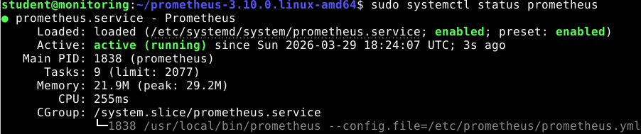](../images/img_53.png)

Erreichbarkeit prüfen: `http://192.168.10.20:9090`

---

### Schritt 6 – Grafana installieren

```bash
sudo mkdir -p /etc/apt/keyrings
wget -q -O - https://packages.grafana.com/gpg.key | gpg --dearmor | sudo tee /etc/apt/keyrings/grafana.gpg > /dev/null

echo "deb [signed-by=/etc/apt/keyrings/grafana.gpg] https://packages.grafana.com/oss/deb stable main" | sudo tee /etc/apt/sources.list.d/grafana.list

sudo apt update
sudo apt install grafana -y

sudo systemctl enable grafana-server
sudo systemctl start grafana-server
```

Erreichbarkeit prüfen: `http://192.168.10.20:3000`

Login: `admin / admin` → Passwort ändern.

---

### Schritt 7 – Prometheus als Datenquelle in Grafana einbinden

**Connections → Data Sources → Add data source → Prometheus**

| Feld | Wert |
| --- | --- |
| Type | Prometheus |
| URL | `http://localhost:9090` |

→ **Save & Test**

[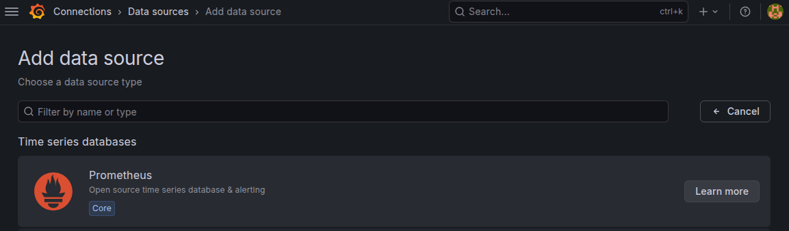](../images/img_54.png)

[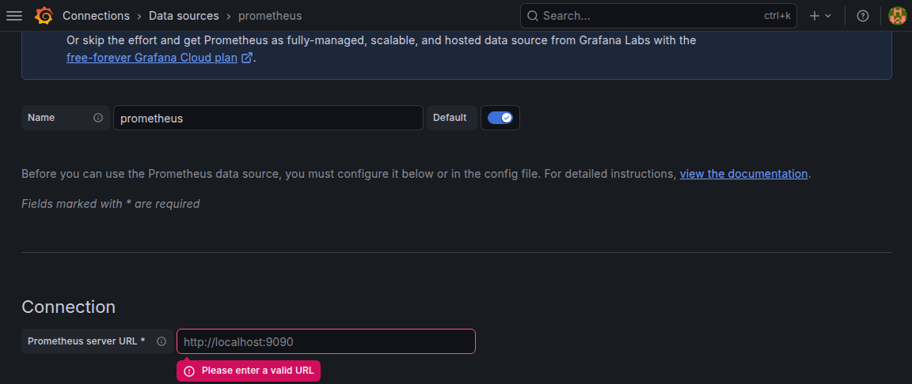](../images/img_55.png)

---

### Schritt 8 – Node Exporter auf Linux-VMs installieren

Auf jeder VM (`mint`, `monitoring`):

```bash
wget https://github.com/prometheus/node_exporter/releases/download/v1.10.2/node_exporter-1.10.2.linux-amd64.tar.gz
tar xvf node_exporter-1.10.2.linux-amd64.tar.gz
cd node_exporter-1.10.2.linux-amd64 
sudo cp node_exporter /usr/local/bin/
```

```bash
sudo nano /etc/systemd/system/node_exporter.service
```

```ini
[Unit]
Description=Node Exporter
After=network.target

[Service]
User=nobody
ExecStart=/usr/local/bin/node_exporter

[Install]
WantedBy=default.target
```

```bash
sudo systemctl daemon-reload
sudo systemctl enable node_exporter
sudo systemctl start node_exporter
```

Funktionsnachweis:

```bash
http://<VM-IP>:9100/metrics

```

---

### Schritt 9 – Node Exporter auf pfSense

pfSense läuft auf FreeBSD – der Linux Node Exporter ist nicht kompatibel. pfSense bringt ein eigenes Paket mit.

**System → Package Manager → Available Packages → `node_exporter` → Install**

Node Exporter als Service aktivieren – über **Diagnostics → Command Prompt**:

```bash
sysrc node_exporter_enable="YES"
service node_exporter start
```

Unter **Status → Services** muss `node_exporter` als aktiv erscheinen.

[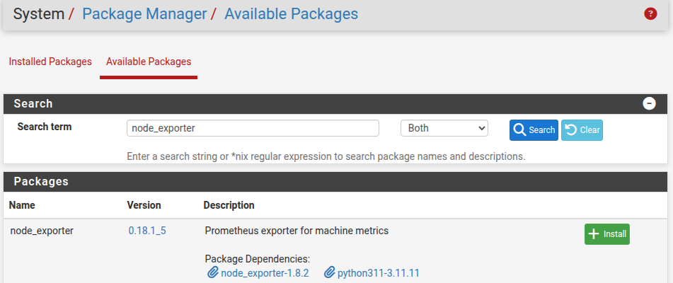](../images/img_58.png)

[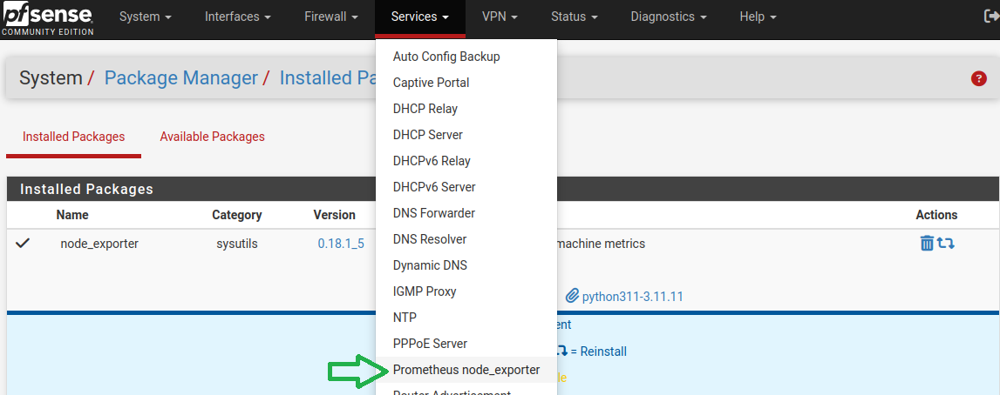](../images/img_63.png)

[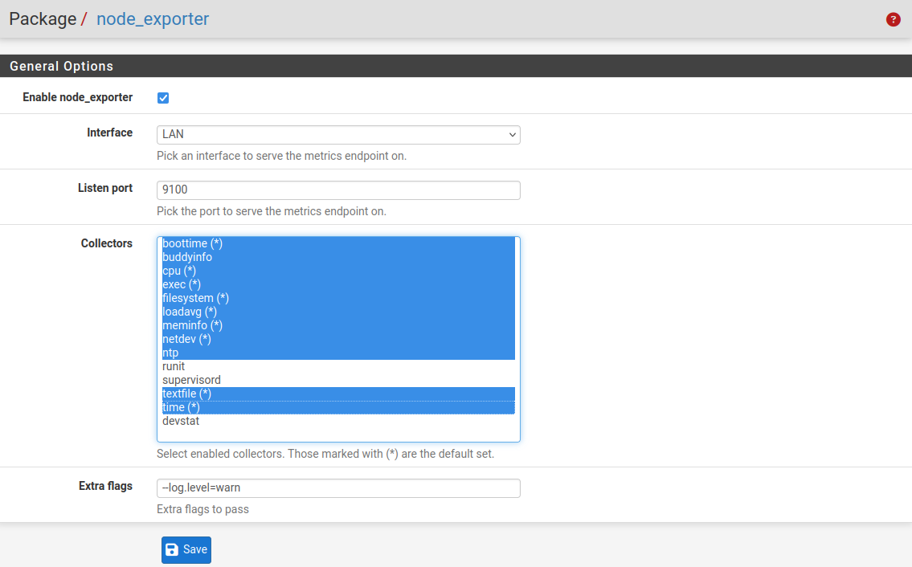](../images/img_64.png)
### Firewall-Regel für Port 9100

LAN-zu-LAN Traffic läuft direkt über den Switch – pfSense sieht ihn nicht. Traffic der pfSense selbst als Ziel hat wird jedoch von pfSense selbst verarbeitet und braucht eine explizite Pass-Regel.

**Firewall → Rules → LAN → ↑ Add**

| Feld | Wert |
| --- | --- |
| Action | Pass |
| Interface | LAN |
| Protocol | TCP |
| Source | `192.168.10.20` |
| Destination | This Firewall (self) |
| Destination Port | 9100 |
| Description | Allow Monitoring → pfSense Node Exporter |

→ **Save** → **Apply Changes**

### Sicherheitsarchitektur

Die Monitoring-VM ist ein dedizierter Monitoring-Knoten mit direktem Zugriff auf pfSense selbst sowie zusätzlichem Zugriff auf das interne Hyper-V-Segment. Diese Zugriffe sind funktional notwendig, werden jedoch durch die Firewalls der jeweiligen Hosts beschränkt.

Ausgehender Internet-Traffic der Monitoring-VM wird in pfSense blockiert – nach der Installation sind alle Targets intern, Internet-Zugang ist nicht notwendig.

**Firewall → Rules → LAN → ↑ Add**

| Feld | Wert |
| --- | --- |
| Action | Block |
| Interface | LAN |
| Protocol | any |
| Source | `192.168.10.20` |
| Destination | `!192.168.10.0/24` |
| Description | Block Monitoring-VM to Internet |

[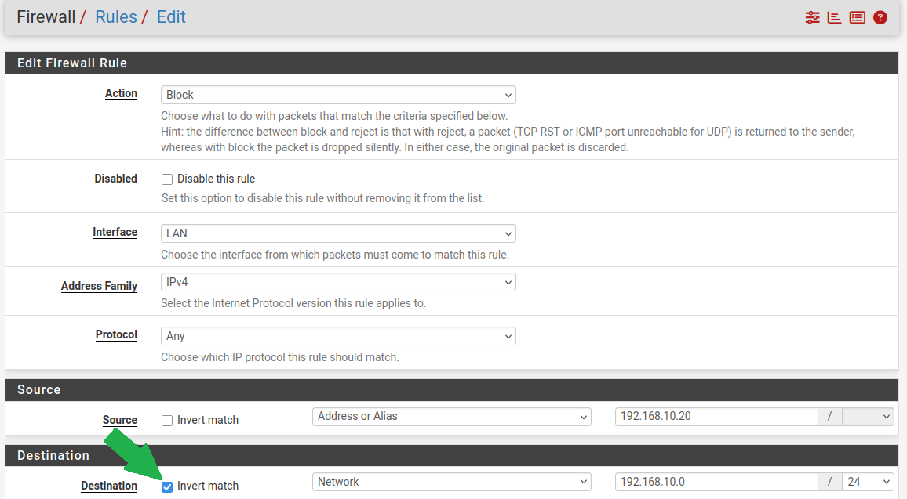](../images/img_71.png)

**"Invert match" bzw. " ! " negiert eine Bedingung:**

`Destination = !192.168.10.0/24` bedeutet: „Nicht das LAN-Netz".

Praktische Auswirkung: Mit `!` wird die Regel auf **alles angewendet, was NICHT das LAN ist** – also auf externen Traffic (Internet, andere VLANs). In Kombination mit der **Block-Action** ergibt sich: „Blockiere den gesamten ausgehenden Traffic, der nicht intern ist."

→ **Save** → **Apply Changes**

---

### Schritt 10 – Windows Exporter auf dem Hyper-V Host

Statt einer Firewall-Regel wird ein dedizierter interner vSwitch zwischen Monitoring-VM und Windows Host eingerichtet. Der Windows Host ist damit nicht ins LAN exponiert – die Verbindung bleibt isoliert.

#### 10.1 – vSwitch anlegen

Auf dem Hyper-V Host (PowerShell als Administrator):

```powershell
New-VMSwitch -Name "monitoring-switch" -SwitchType Internal
```

Der neue vSwitch bekommt automatisch einen Netzwerkadapter auf dem Host. Diesem eine statische IP zuweisen:

```powershell
New-NetIPAddress -InterfaceAlias "vEthernet (monitoring-switch)" -IPAddress 10.10.10.1 -PrefixLength 24
```

#### 10.2 – Monitoring-VM mit vSwitch verbinden

```powershell
Add-VMNetworkAdapter -VMName "MonitoringVM" -SwitchName "monitoring-switch"
```

Auf der Monitoring-VM die neue Netzwerkschnittstelle konfigurieren:

```bash
sudo nano /etc/netplan/01-monitoring-switch.yaml
```

```yaml
network:
  version: 2
  ethernets:
    eth1:
      addresses:
        - 10.10.10.2/24
```

Berechtigungen setzen und anwenden:

```bash
sudo chmod 600 /etc/netplan/01-monitoring-switch.yaml
sudo netplan apply
```

### 10.3 – Windows Exporter installieren

Version 0.31.5 herunterladen:
`https://github.com/prometheus-community/windows_exporter/releases/download/v0.31.5/windows_exporter-0.31.5-amd64.msi`

Im Setup-Wizard:

[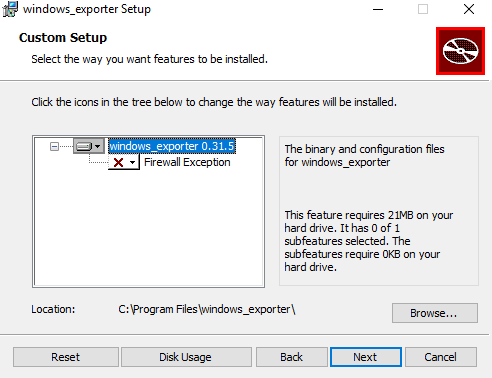](../images/img_56.png)

**Firewall Exception:** im MSI-Wizard deaktivieren – Firewall-Regeln werden manuell und interface-spezifisch angelegt.

**Collectors:** `cpu,logical_disk,net,os,system,hyperv`

[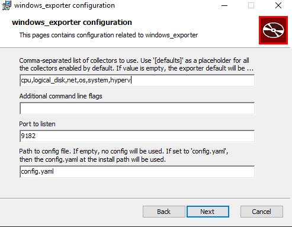](../images/img_57.png)

| Collector | Metriken |
| --- | --- |
| `cpu` | CPU-Auslastung pro Core + gesamt |
| `logical_disk` | I/O pro Laufwerk (Read/Write, Queue Length) |
| `net` | Netzwerktraffic + Errors pro Interface |
| `os` | Uptime, Prozesse, grundlegender Systemzustand |
| `system` | Threads und Prozesse gesamt |
| `hyperv` | VM-spezifische Metriken direkt vom Hypervisor |

**Port:** 9182

### 10.4 – Windows Firewall Regeln anlegen

Die Windows Firewall blockiert standardmäßig eingehenden Traffic – auch auf dem internen vSwitch. Regeln explizit auf `vEthernet (monitoring-switch)` beschränken, damit Port 9182 nicht auf allen Interfaces geöffnet wird.

```powershell
New-NetFirewallRule `
  -DisplayName "monitoring-switch 9182 from Prometheus" `
  -Direction Inbound `
  -Protocol TCP `
  -LocalPort 9182 `
  -RemoteAddress 10.10.10.2 `
  -InterfaceAlias "vEthernet (monitoring-switch)" `
  -Action Allow
```

```powershell
New-NetFirewallRule `
  -DisplayName "monitoring-switch ICMP from Prometheus" `
  -Direction Inbound `
  -Protocol ICMPv4 `
  -RemoteAddress 10.10.10.2 `
  -InterfaceAlias "vEthernet (monitoring-switch)" `
  -Action Allow
```

> **Beide Regeln sind auf `vEthernet (monitoring-switch)` beschränkt – Port 9182 ist damit ausschließlich über den dedizierten Monitoring-Switch erreichbar, nicht über LAN oder WAN.**

### 10.5 – Target in prometheus.yml ergänzen

```yaml
- 10.10.10.1:9182   # Windows Host (Hyper-V)
```

[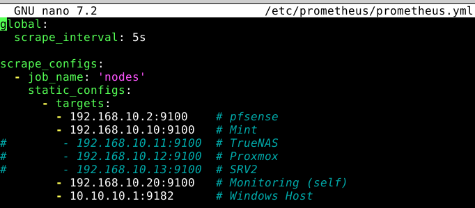](../images/img_65.png)


```bash
sudo systemctl restart prometheus
```

### 10.6 – Funktionsnachweis

Von der Monitoring-VM:

```bash
ping 10.10.10.1 -c 4
curl http://10.10.10.1:9182/metrics | grep product=
```

[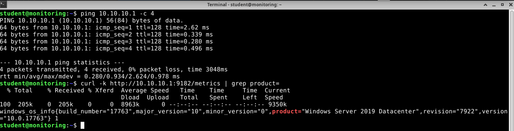](../images/img_60.png)

---

## Schritt 11 – Funktionsnachweis: Prometheus Targets

Alle konfigurierten Targets müssen im Status **UP** erscheinen.

`http://192.168.10.20:9090/targets`


[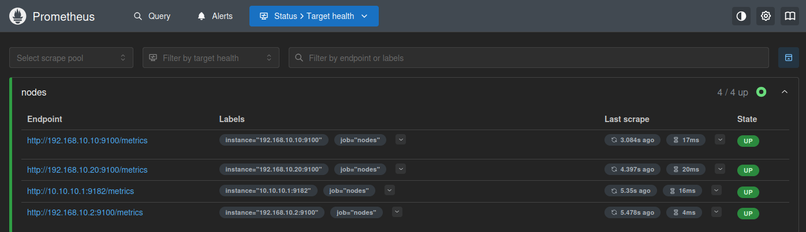](../images/img_66.png)

---

## Schritt 12 – Funktionsnachweis: Grafana Dashboards

Grafana ermöglicht den Import vorgefertigter Community-Dashboards direkt über [grafana.com/dashboards](https://grafana.com/grafana/dashboards/). Der Importprozess ist für beide Dashboards identisch:

**Dashboards → New → Import**

[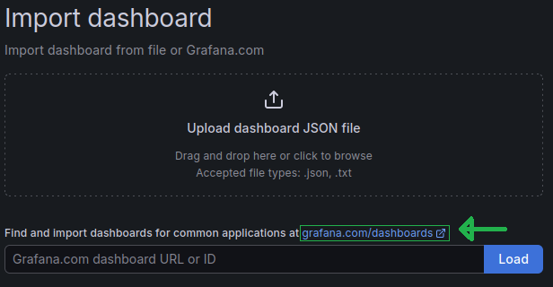](../images/img_67.png)

Im Eingabefeld **„Grafana.com dashboard URL or ID"** die jeweilige ID eintragen und **Load** klicken. Die Dashboard-ID ist auf grafana.com bei jedem Dashboard über **Copy ID to clipboard** abrufbar.

---

### Node Exporter Full (ID 1860)

Dashboard auf [grafana.com/grafana/dashboards/1860](https://grafana.com/grafana/dashboards/1860) suchen oder direkt ID `1860` im Import-Feld eintragen.

[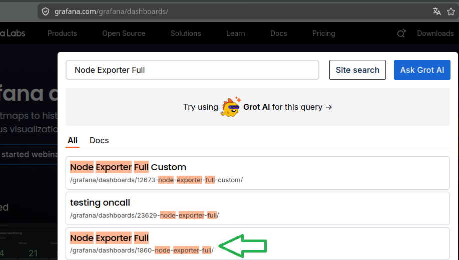](../images/img_68.png)

[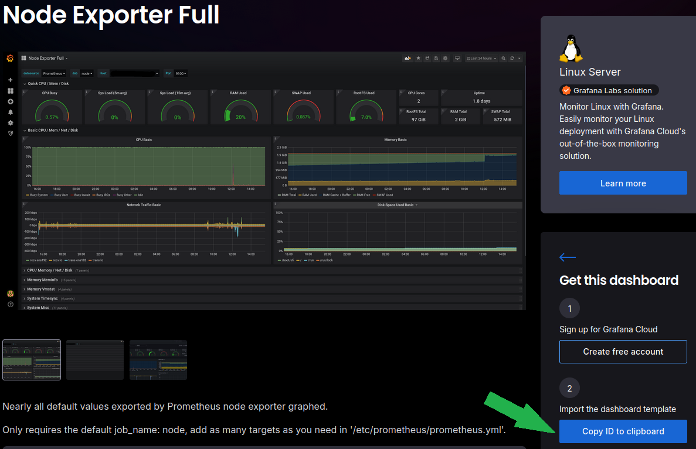](../images/img_69.png)

**Dashboards → New → Import → ID `1860` → Load**

Datasource: `prometheus` → **Import**

Zeigt CPU, RAM, Disk und Netzwerk für alle Linux-Targets und pfSense. Über den **Nodename**-Filter lassen sich einzelne Hosts auswählen: `Mint-Machine`, `monitoring`, `pfSense`.

[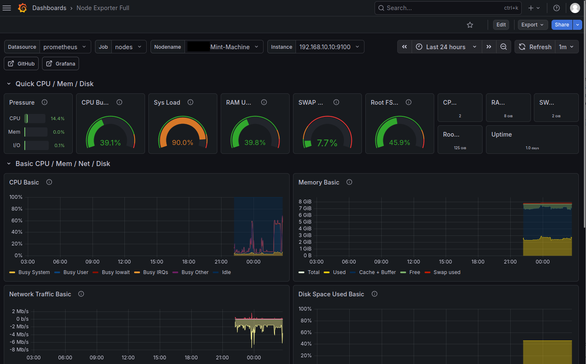](../images/img_72.png)


---

### Windows Server Status Dashboard (ID 16523)

Dashboard auf [grafana.com/grafana/dashboards/16523](https://grafana.com/grafana/dashboards/16523) suchen oder direkt ID `16523` im Import-Feld eintragen. Die ID wird analog zu 1860 über **Copy ID to clipboard** übernommen.

[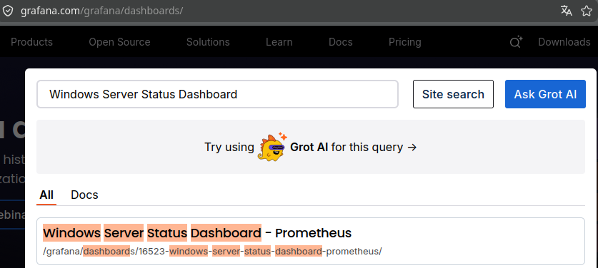](../images/img_70.png)

**Dashboards → New → Import → ID `16523` → Load**

Datasource: `prometheus` → **Import**

Zeigt CPU, RAM, Disk und Netzwerk des Hyper-V Hosts. Instance: `10.10.10.1:9182`.

[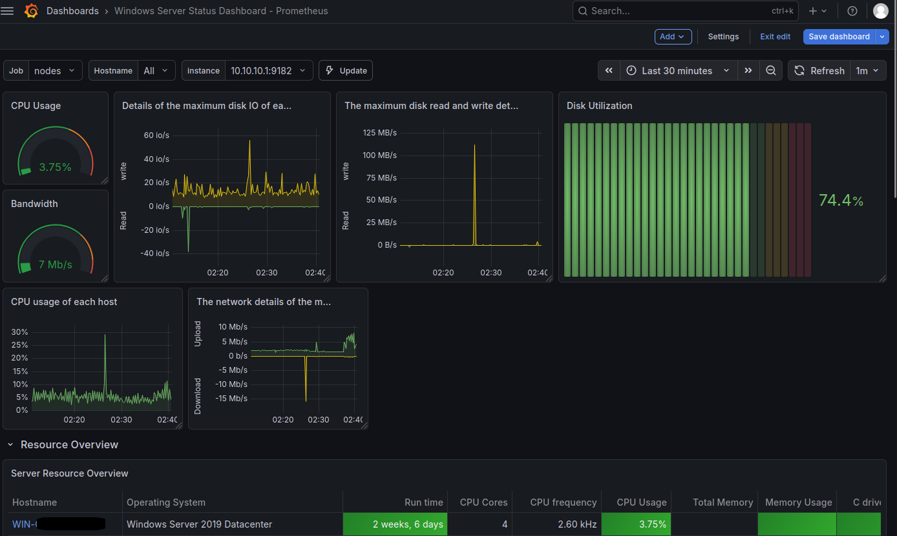](../images/img_73.png)


---

## Abschluss-Übersicht


Die Monitoring-Infrastruktur ist vollständig operativ. Alle Targets werden von Prometheus gescrapt, Metriken sind in Grafana visualisiert. 