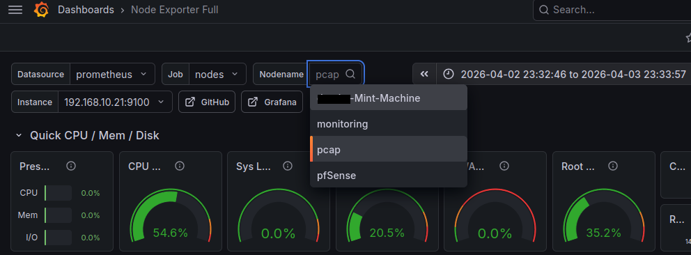

## Teil VIII: Capture-VM – Wire-Level-Debugging

### Grundkonzept

Kapitel 07 liefert **Monitoring** (Zeitreihen/Verlauf). Die Capture-VM ergänzt das Monitoring um Wire-Level-Debugging – sie beantwortet nicht nur ob etwas auf dem Netzwerk passiert, sondern was genau auf dem Netzwerk passiert: welche Pakete fließen, welche verloren gehen, welche Protokolle tatsächlich genutzt werden.

#### Warum eine eigene VM?

Die Capture-VM läuft im **Promiscuous Mode** als Port-Mirroring-Destination – sie empfängt Fremdtraffic, den keine andere VM zu sehen bekommt. Diese Rolle wird bewusst isoliert:

- **Separation of Concerns:** Monitoring speichert Zeitreihen; Capture empfängt gespiegelten Traffic passiv und analysiert Paketinhalt. Capture erzeugt keinen eigenen Mess-Traffic – das ist nicht Aufgabe der Capture-VM.
- **Sicherheit:** Eine VM, die den gesamten LAN-Traffic sehen könnte, bekommt keinen Internet-Zugang und keine produktiven Dienste.
- **Stabilität:** Fällt die Capture-VM aus oder wird sie neu gestartet, bleibt das Monitoring unberührt.

---

### Rollenübersicht

| Rolle | VM | IP | Tools | Aufgabe |
| --- | --- | --- | --- | --- |
| MonitoringVM | `MonitoringVM` | `192.168.10.20` | Prometheus, Grafana, Node Exporter | Monitoring und Visualisierung |
| CaptureVM | `CaptureVM` | `192.168.10.21` | tcpdump, ethtool, Node Exporter    |  Wire-Level-Debugging via Port Mirroring   |

---

### Schritt 1 – Capture-VM anlegen

#### 1.1 – VM erstellen (Hyper-V)

**Hyper-V Manager → Neu → Virtueller Computer**

| Feld | Wert |
| --- | --- |
| Name | `CaptureVM` |
| OS | Ubuntu Server 24.04 LTS Minimal |
| RAM | 2048 MB |
| CPU | 2 vCPU |
| Disk | 20 GB |
| Netzwerk | Firmennetzwerk |

#### 1.2 – Basis-Setup

Nach der Installation:

```bash
sudo apt update
sudo apt upgrade -y
sudo hostnamectl set-hostname pcap
```

#### 1.3 – Static Mapping in pfSense

MAC-Adresse ermitteln:

```bash
ip link show
```

Die MAC-Adresse steht hinter `link/ether`, z. B.: `link/ether 00:15:5d:01:02:03`.

**Services → DHCP Server → LAN → Static Mappings → + Add**

| Feld | Wert |
| --- | --- |
| MAC Address | MAC der capture-VM |
| IP Address | `192.168.10.21` |
| Hostname | `pcap` |
| Description | CaptureVM |

☑ **Create a static ARP table entry for this MAC & IP Address pair**

→ **Save**

[](../images/img_74.png)

Lease erneuern:

```bash
sudo networkctl renew eth0
ip a
```

Erwartung: `inet 192.168.10.21/24` ist zugewiesen.

#### 1.5 – Hyper-V Time Sync deaktivieren

Auf dem Hyper-V Host (PowerShell als Administrator):

```powershell
Disable-VMIntegrationService -VMName "CaptureVM" -Name "Zeitsynchronisierung"
```

Validierung:

```powershell
Get-VMIntegrationService -VMName "CaptureVM" | Where-Object { $_.Name -like "*Zeit*" }
```

Erwartung: `Enabled: False`

#### 1.6 – NTP auf pfSense umstellen

Testen ob Enforcement greift:

```bash
timedatectl timesync-status
```

[](../images/img_75.png)

Analog zu Kapitel 05:

```bash
sudo nano /etc/systemd/timesyncd.conf
```

```ini
[Time]
NTP=pfsense.example.internal
```

```bash
sudo systemctl restart systemd-timesyncd
timedatectl timesync-status
```

`Server: 192.168.10.2` und `Packet count` > 0 bestätigen erfolgreiche Synchronisation.

[](../images/img_76.png)

#### 1.7 – DNS Enforcement prüfen

Ubuntu 24.04 verwendet `systemd-resolved`. `/etc/resolv.conf` zeigt in diesem Setup den internen Stub-Resolver (`127.0.0.53`), nicht die echte DNS-IP. Die tatsächlich verwendeten DNS-Server prüfen:

```bash
nslookup google.com 8.8.8.8
nslookup google.com pfsense.example.internal
```

[](../images/img_77.png)

#### 1.8 – Pakete installieren (vor Internet-Sperre)

Alle benötigten Pakete und Binaries **vor** dem Blockieren des Internet-Zugangs installieren:

```bash
sudo apt install -y tcpdump dnsutils nano

wget https://github.com/prometheus/node_exporter/releases/download/v1.10.2/node_exporter-1.10.2.linux-amd64.tar.gz
tar xvf node_exporter-1.10.2.linux-amd64.tar.gz
sudo cp node_exporter-1.10.2.linux-amd64/node_exporter /usr/local/bin/
```


#### 1.9 – Node Exporter einrichten

```bash
sudo nano /etc/systemd/system/node_exporter.service
```

```ini
[Unit]
Description=Node Exporter
After=network.target

[Service]
User=nobody
ExecStart=/usr/local/bin/node_exporter

[Install]
WantedBy=default.target
```

```bash
sudo systemctl daemon-reload
sudo systemctl enable node_exporter
sudo systemctl start node_exporter
```

Funktionsnachweis:

```bash
sudo systemctl status node_exporter
```

Erwartung: `Active: active (running)`

#### 1.10 – Target in prometheus.yml ergänzen

Auf der Monitoring-VM (`192.168.10.20`):

```bash
sudo nano /etc/prometheus/prometheus.yml
```

Eintrag ergänzen:

```yaml
        - 192.168.10.21:9100   # CaptureVM
```

```bash
sudo systemctl restart prometheus
```

Funktionsnachweis: `http://192.168.10.20:9090/targets` → `192.168.10.21:9100` muss `State: UP` zeigen.

[](../images/img_78.png)

[](../images/img_79.png)

> Kurze Aktualisierung des Browserfensters ist ausreichend damit unter Nodename 'pcap' aufrufbar wird.