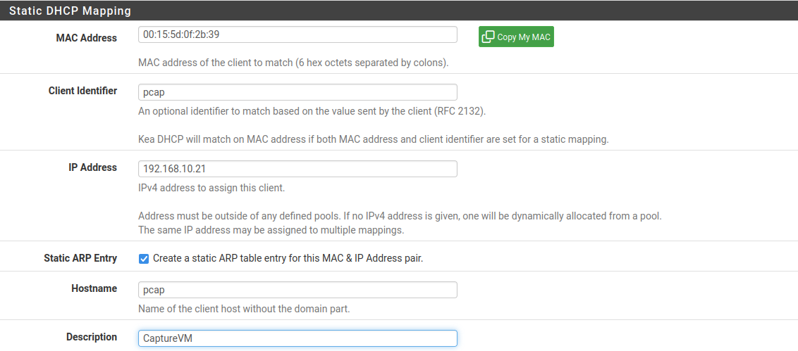
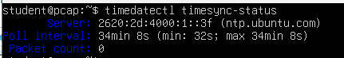
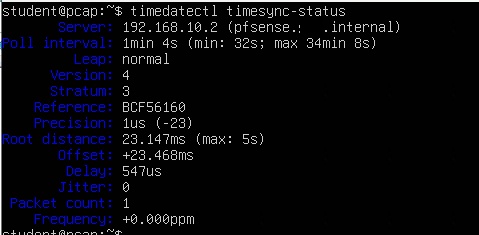
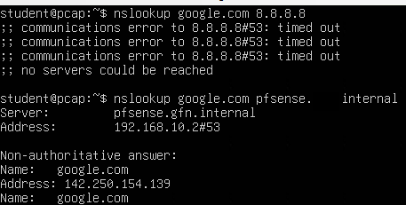
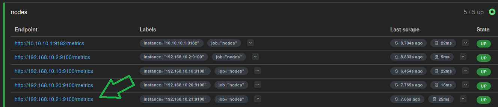
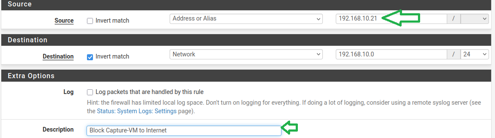
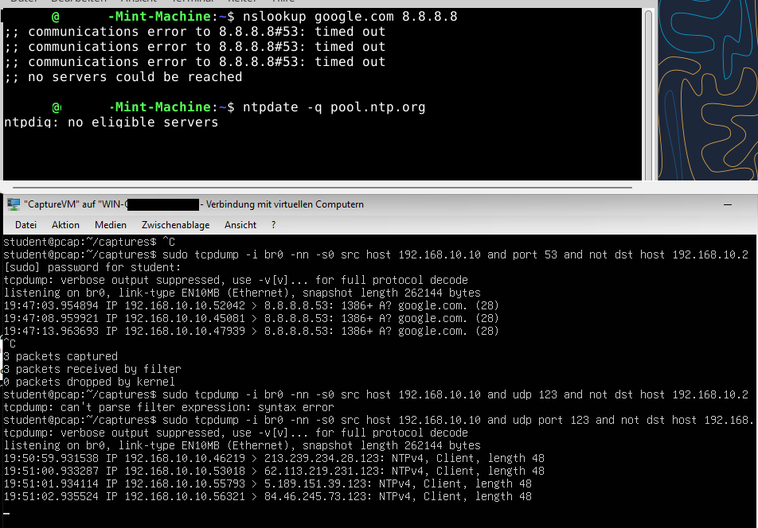
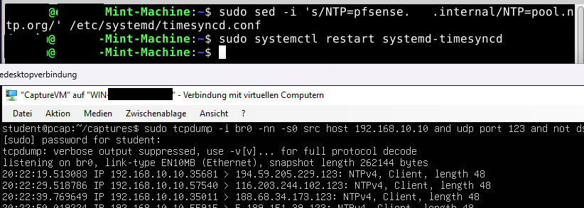

## Teil VIII: Capture-VM – Wire-Level-Debugging

### Grundkonzept

Kapitel 07 liefert **Monitoring** (Zeitreihen/Verlauf). Die Capture-VM ergänzt das Monitoring um Wire-Level-Debugging – sie beantwortet nicht nur ob etwas auf dem Netzwerk passiert, sondern was genau auf dem Netzwerk passiert: welche Pakete fließen, welche verloren gehen, welche Protokolle tatsächlich genutzt werden.

#### Architekturprinzip: Inline-Capture via Bridge

Hyper-V Port Mirroring und pfSense `dup-to` wurden in ADR-01 evaluiert; beide wurden verworfen. Die Entscheidungsdokumentation mit allen geprüften Optionen und Begründungen liegt in [ADR-01 – Capture-Methode](../decisions/01-capture-method.md)(ADR-01).

Die Capture-VM arbeitet im **Inline-Modus**:

```
LAN-Clients (Firmennetzwerk) ↔ CaptureVM (br0) ↔ pcap-br ↔ pfSense LAN
```


Die VM betreibt eine transparente Linux-Bridge zwischen zwei Hyper-V-vSwitches (Firmennetzwerk ↔ pcap-br). Dadurch läuft der gesamte Verkehr zwischen LAN-Clients und pfSense durch `br0` und ist vollständig sichtbar, einschließlich Layer 2.

Die Architektur ergibt sich direkt aus der gewählten Capture-Methode: Eine transparente Bridge zwischen zwei vSwitches erfordert eine dedizierte VM als Träger. Die Capture-VM ist damit kein eigenständiges Architekturziel, sondern eine technische Konsequenz dieser Entscheidung.

Mit dieser Architektur übernimmt die Capture-VM eine Rolle im kritischen Netzwerkpfad: Sämtlicher Traffic zwischen LAN-Clients und pfSense wird durch sie geleitet. Bei einem Ausfall ist dieser Pfad vollständig unterbrochen – DHCP-Vergabe, DNS-Auflösung und alle Monitoring-Targets hinter der Bridge sind nicht mehr erreichbar.

---

### Rollenübersicht

| Rolle | VM | IP | Tools | Aufgabe |
| --- | --- | --- | --- | --- |
| MonitoringVM | `MonitoringVM` | `192.168.10.20` | Prometheus, Grafana, Node Exporter | Monitoring und Visualisierung |
| CaptureVM | `CaptureVM` | `192.168.10.21` | tcpdump, bridge-utils, ethtool, Node Exporter | Wire-Level-Debugging via Inline-Bridge |

---

### Schritt 1 – Capture-VM anlegen

#### 1.1 – VM erstellen (Hyper-V)

**Hyper-V Manager → Neu → Virtueller Computer**

| Feld | Wert |
| --- | --- |
| Name | `CaptureVM` |
| OS | Ubuntu Server 24.04 LTS Minimal |
| RAM | 2048 MB |
| CPU | 2 vCPU |
| Disk | 20 GB |
| Netzwerkkarte 1 | `Firmennetzwerk` |
| Netzwerkkarte 2 | `pcap-br` (neuer interner vSwitch – siehe unten) |

**Vor der VM-Erstellung: internen vSwitch anlegen**

**Hyper-V Manager → Virtueller Switch-Manager → Neu → Intern → Erstellen**

| Feld | Wert |
| --- | --- |
| Name | `pcap-br` |
| Typ | Intern |

Dieser vSwitch verbindet ausschließlich CaptureVM und pfSense. Er hat keinen Zugang zum physischen Netz.

#### 1.2 – Basis-Setup

Nach der Installation:

```bash
sudo apt update
sudo apt upgrade -y
sudo hostnamectl set-hostname pcap
sudo apt install -y bridge-utils tcpdump dnsutils nano ethtool
```

#### 1.3 – Bridge einrichten

Persistente Konfiguration via netplan:

```bash
sudo nano /etc/netplan/01-bridge.yaml
```

```yaml
network:
  version: 2
  renderer: networkd

  ethernets:
    eth0: {}
    eth1: {}

  bridges:
    br0:
      interfaces: [eth0, eth1]
      addresses: [192.168.10.21/24]
      nameservers:
        addresses: [192.168.10.2]
      routes:
        - to: default
          via: 192.168.10.2
```

```bash
sudo chmod 600 /etc/netplan/01-bridge.yaml
sudo netplan apply
```

Validierung:

```bash
ip a show br0
```

Erwartung: `inet 192.168.10.21/24` auf `br0` zugewiesen.

#### 1.4 – Static Mapping in pfSense

Die Bridge bekommt eine eigene MAC-Adresse – nicht die von `eth0`. Daher erst nach `netplan apply` die MAC von `br0` ermitteln:

```bash
ip link show br0
```

Die MAC-Adresse steht hinter `link/ether`, z. B.: `link/ether 2a:28:cf:b3:f7:57`.

**Services → DHCP Server → LAN → Static Mappings → + Add**

| Feld | Wert |
| --- | --- |
| MAC Address | MAC von `br0` der CaptureVM |
| IP Address | `192.168.10.21` |
| Hostname | `pcap` |
| Description | CaptureVM |

☑ **Create a static ARP table entry for this MAC & IP Address pair**

→ **Save**

[](../images/img_74.png)

Lease erneuern und IP-Zuweisung bestätigen:

```bash
sudo networkctl renew br0
ip a show br0
```

Erwartung: `inet 192.168.10.21/24` zugewiesen.

#### 1.5 – Hyper-V Time Sync deaktivieren

Auf dem Hyper-V Host (PowerShell als Administrator):

```powershell
Disable-VMIntegrationService -VMName "CaptureVM" -Name "Zeitsynchronisierung"
```

Validierung:

```powershell
Get-VMIntegrationService -VMName "CaptureVM" | Where-Object { $_.Name -like "*Zeit*" }
```

Erwartung: `Enabled: False`

#### 1.6 – MAC Address Spoofing aktivieren (Pflicht)

Eine transparente Bridge leitet Frames mit fremden Quell-MACs weiter. Hyper-V verwirft solche Frames standardmäßig stillschweigend. MAC Address Spoofing muss auf allen beteiligten NICs aktiviert werden – ohne diese Einstellung fließt kein Traffic durch die Bridge.

Auf dem Hyper-V Host (PowerShell als Administrator):

```powershell
Get-VMNetworkAdapter -VMName "CaptureVM" | Set-VMNetworkAdapter -MacAddressSpoofing On
Set-VMNetworkAdapter -VMName "pfsense router" -Name "LAN" -MacAddressSpoofing On
```

#### 1.7 – pfSense LAN-NIC auf pcap-br verschieben (Pflicht)

Dieser Schritt ist der „Go-Live"-Moment: Erst danach fließt tatsächlicher Traffic durch die Bridge.

> ⚠️ Während der Umstellung ist die pfSense LAN-Seite kurz nicht erreichbar. 

Auf dem Hyper-V Host (PowerShell als Administrator):

Aktuelle NIC-Zuweisung der pfSense-VM prüfen:

```powershell
Get-VMNetworkAdapter -VMName "pfsense router" | Format-Table Name,SwitchName
Get-VMNetworkAdapter -VMName "CaptureVM"       | Format-Table Name,SwitchName
```

LAN-Adapter auf `pcap-br` verschieben:

```powershell
$nic = Get-VMNetworkAdapter -VMName "pfsense router" | Where-Object Name -eq "LAN"
Connect-VMNetworkAdapter -VMNetworkAdapter $nic -SwitchName "pcap-br"
```

Validierung:

```powershell
Get-VMNetworkAdapter -VMName "pfsense router" | Format-Table Name,SwitchName
Get-VMNetworkAdapter -VMName "CaptureVM"       | Format-Table Name,SwitchName
```

Erwartung:

| VM | Interface | SwitchName |
| --- | --- | --- |
| `pfsense router` | LAN | `pcap-br` |
| `CaptureVM` | eth0 | `Firmennetzwerk` |
| `CaptureVM` | eth1 | `pcap-br` |

Anschließend auf der CaptureVM prüfen, ob Traffic über die Bridge fließt:

```bash
sudo tcpdump -i br0 -nn -c 20
```

Erwartung: Pakete aus dem LAN sind sichtbar (DHCP, ARP, DNS o. ä.).

#### Notfall-Workaround: Bypass der Capture-VM

Fällt die Capture-VM aus und muss die LAN-Konnektivität sofort wiederhergestellt werden (Hyper-V Host, PowerShell als Administrator):

```powershell
$nic = Get-VMNetworkAdapter -VMName "pfsense router" | Where-Object SwitchName -eq "pcap-br"
Connect-VMNetworkAdapter -VMNetworkAdapter $nic -SwitchName "Firmennetzwerk"
```

Damit ist pfSense LAN direkt auf `Firmennetzwerk` zurückgeschaltet. Capture-Funktionalität entfällt bis zur Wiederherstellung der Bridge.

#### 1.8 – NTP auf pfSense umstellen

Testen ob Enforcement greift:

```bash
timedatectl timesync-status
```

[](../images/img_75.png)

Analog zu Kapitel 05:

```bash
sudo nano /etc/systemd/timesyncd.conf
```

```ini
[Time]
NTP=pfsense.example.internal
```

```bash
sudo systemctl restart systemd-timesyncd
timedatectl timesync-status
```

`Server: 192.168.10.2` und `Packet count` > 0 bestätigen erfolgreiche Synchronisation.

[](../images/img_76.png)


#### 1.9 – DNS Enforcement prüfen

```bash
nslookup google.com 8.8.8.8
nslookup google.com pfsense.example.internal
```

#### 1.10 – Pakete und Binaries herunterladen (vor Internet-Sperre)

**Vor** dem Blockieren des Internet-Zugangs:

```bash
wget https://github.com/prometheus/node_exporter/releases/download/v1.10.2/node_exporter-1.10.2.linux-amd64.tar.gz
tar xvf node_exporter-1.10.2.linux-amd64.tar.gz
sudo cp node_exporter-1.10.2.linux-amd64/node_exporter /usr/local/bin/
```

[](../images/img_77.png)

#### 1.11 – Node Exporter einrichten

```bash
sudo nano /etc/systemd/system/node_exporter.service
```

```ini
[Unit]
Description=Node Exporter
After=network.target

[Service]
User=nobody
ExecStart=/usr/local/bin/node_exporter

[Install]
WantedBy=default.target
```

```bash
sudo systemctl daemon-reload
sudo systemctl enable node_exporter
sudo systemctl start node_exporter
```

Funktionsnachweis:

```bash
sudo systemctl status node_exporter
```

Erwartung: `Active: active (running)`


#### 1.12 – Target in prometheus.yml ergänzen

Auf der Monitoring-VM (`192.168.10.20`):

```bash
sudo nano /etc/prometheus/prometheus.yml
```

Eintrag ergänzen:

```yaml
        - 192.168.10.21:9100   # CaptureVM
```

```bash
sudo systemctl restart prometheus
```

Funktionsnachweis: `http://192.168.10.20:9090/targets` → `192.168.10.21:9100` muss `State: UP` zeigen.

[](../images/img_78.png)

#### 1.13 – Firewall-Regel: Internet-Zugang blockieren

**Firewall → Rules → LAN → ↑ Add**

| Feld | Wert |
| --- | --- |
| Action | Block |
| Interface | LAN |
| Protocol | any |
| Source | `192.168.10.21` |
| Destination | `!192.168.10.0/24` |
| Description | Block Capture-VM to Internet |

[](../images/img_80.png)


[](../images/img_81.png)

Die Firewall-Regel entspricht der bereits in `07-monitoring.md` angelegten `Block Monitoring-VM to Internet`. Der Kopieren-Button kann genutzt werden; `Source-IP` und `Description` müssen angepasst werden.

→ **Save** → **Apply Changes**

---

#### 1.14 – Gezielter Capture: DNS- und NTP-Policy

Trigger: Firewall-Log zeigt geblockte Anfrage auf Port 53 oder 123 von einem LAN-Host.

Der Filter kombiniert immer zwei Bedingungen: Quell-Host und falsches Ziel. Ein Host der pfSense korrekt anfragt ist kein Verstoß — der Capture soll ausschließlich Abweichungen sichtbar machen.

**DNS-Verstoß eines bekannten Hosts:**

```bash
# Host .10 fragt externen DNS
sudo tcpdump -i br0 -nn -s0 \
  'src host 192.168.10.10 and port 53 and not dst host 192.168.10.2'
```

**DNS-Verstöße aus dem gesamten LAN (unbekannte Quelle):**

```bash
sudo tcpdump -i br0 -nn -s0 \
  'port 53 and not dst host 192.168.10.2 and not src host 192.168.10.2'
```

> `not src host 192.168.10.2` schließt Unbound-eigene Upstream-Anfragen aus — pfSense selbst fragt externe Resolver, das ist kein Verstoß.

**NTP-Verstoß eines bekannten Hosts:**

```bash
sudo tcpdump -i br0 -nn -s0 \
  'src host 192.168.10.10 and udp port 123 and not dst host 192.168.10.2'
```

**NTP-Verstöße aus dem gesamten LAN:**

```bash
sudo tcpdump -i br0 -nn -s0 \
  'udp port 123 and not dst host 192.168.10.2 and not src host 192.168.10.2'
```

> `not src host 192.168.10.2` schließt pfSense-eigenen Upstream-NTP-Traffic aus — pfSense fragt `de.pool.ntp.org`, das ist kein Verstoß.

**Beide Protokolle gleichzeitig, gesamtes LAN:**

```bash
sudo tcpdump -i br0 -nn -s0 \
  '(port 53 or udp port 123) and not dst host 192.168.10.2 and not src host 192.168.10.2'
```


**DNS-Verstoß provozieren**

Auf dem Client (`mint-machine`, `192.168.10.10`) — in einem zweiten Terminal, während tcpdump auf der CaptureVM läuft:

```bash
# DNS-Verstoß: externen Resolver direkt ansprechen
nslookup google.com 1.1.1.1
```

`nslookup` sendet den DNS-Request unabhängig davon ob eine Antwort kommt — das Paket verlässt den Client, läuft durch `br0` und wird von pfSense geblockt. tcpdump sieht den Request, keine Response. Das ist der erwartete Befund.

[](../images/img_82.png)

> Oben: `nslookup google.com 8.8.8.8` läuft auf mint-machine in Timeout — pfSense blockt. `ntpdate -q pool.ntp.org` liefert `ntpdig: no eligible servers`. Unten: tcpdump auf `br0` sieht die DNS-Requests von `192.168.10.10` an `8.8.8.8:53` (3 Pakete, keine Response), anschließend die NTP-Requests von `192.168.10.10` an mehrere pool.ntp.org-Adressen (keine Response). Der Capture beweist: die Pakete verlassen den Client und laufen durch die Bridge — pfSense empfängt und blockiert sie.

**NTP-Verstoß provozieren**

```bash
# NTP-Verstoß: timesyncd temporär auf externen Server umbiegen
sudo sed -i 's/NTP=pfsense.example.internal/NTP=pool.ntp.org/' /etc/systemd/timesyncd.conf
sudo systemctl restart systemd-timesyncd

# wiederherstellen
sudo sed -i 's/NTP=pool.ntp.org/NTP=pfsense.example.internal/' /etc/systemd/timesyncd.conf
sudo systemctl restart systemd-timesyncd
```

Das erzeugt authentischen `systemd-timesyncd`-Traffic — denselben Pfad den die VM im Normalbetrieb nutzt. pfSense blockiert den ausgehenden Request, tcpdump sieht Request ohne Response. `timedatectl timesync-status` zeigt `Packet count: 0` als Bestätigung dass keine Antwort ankam. 


[](../images/img_83.png)

> Sobald timesyncd neugestartet wird, meldet sich der Filter unweigerlich.

---

#### 1.15 – PCAP-Konvention

Captures werden unter `~/captures/` abgelegt:

```bash
mkdir -p ~/captures
cd ~/captures
```

Dateinamenschema: `<protokoll>_<datum>_<uhrzeit>_<kurzbeschreibung>.pcapng`

```bash
# DNS
sudo tcpdump -i br0 -nn -s0 -w dns_$(date +%F_%H%M)_case.pcapng port 53

# NTP
sudo tcpdump -i br0 -nn -s0 -w ntp_$(date +%F_%H%M)_case.pcapng udp port 123
```

**Capture-Trigger**

Ein Capture wird ausschließlich bei konkretem Anlass gestartet – kein Dauerbetrieb.

Jeder Capture erfordert vor dem Start:

```text
Anlass:        <was wurde beobachtet, wo>
Filter:        <tcpdump-Ausdruck>
Stopbedingung: <wann wird gestoppt, z. B. nach erstem vollständigem Exchange>
```

Capture stoppen: `Ctrl+C`

---

### Abschluss

Mit diesem Kapitel ist die Enforcement-Policy aus Kapitel 06 auf drei Ebenen überprüfbar:

pfSense (Policy): Das Firewall-Log zeigt, dass die Regel greift.
Client (Wirkung): Anfragen schlagen fehl (nslookup, timedatectl).
CaptureVM (Netzwerkebene): Der Request ist auf br0 sichtbar, eine Response fehlt.

Erst die Kombination dieser drei Perspektiven zeigt den vollständigen Ablauf:
Der Client sendet den Request, das Paket erreicht pfSense, und wird dort durch die Policy blockiert.

Die CaptureVM ergänzt damit Monitoring und Logs um eine direkte Sicht auf den tatsächlichen Netzwerkverkehr und macht das Verhalten auf Paketebene nachvollziehbar.

Kapitel 09 baut darauf auf und nutzt die CaptureVM zur Analyse gezielt erzeugten Traffics.
