## Teil IX: Analysis-VM – Aktiver Messpunkt

### Grundkonzept

Kapitel 07 erkennt Abweichungen (Zeitreihen), Kapitel 08 erklärt sie (Paketebene). Die Analysis-VM quantifiziert sie: Sie erzeugt kontinuierlich definierten Messtraffic von einem stabilen, reproduzierbaren Punkt aus und exportiert die Ergebnisse als Prometheus-Metriken.

Die MonitoringVM scrapt Metriken von anderen Systemen – sie misst nicht selbst. Die AnalysisVM misst aktiv: NTP-Offset gegen pfSense, DNS-Antwortzeiten, ICMP-Erreichbarkeit definierter Targets.

Regel: Die AnalysisVM erzeugt Messtraffic. Sie speichert keine Daten – das ist Aufgabe der MonitoringVM.

---

### Rollenübersicht

| Rolle | VM | IP | Tools | Aufgabe |
| --- | --- | --- | --- | --- |
| MonitoringVM | `MonitoringVM` | `192.168.10.20` | Prometheus, Grafana, Node Exporter | Monitoring und Visualisierung |
| CaptureVM | `CaptureVM` | `192.168.10.21` | tcpdump, bridge-utils, Node Exporter | Wire-Level-Debugging via Inline-Bridge |
| AnalysisVM | `AnalysisVM` | `192.168.10.22` | blackbox_exporter, Node Exporter | Aktiver Messpunkt, Baseline-Erzeugung |

---

### Schritt 1 – Analysis-VM anlegen

#### 1.1 – VM erstellen (Hyper-V)

**Hyper-V Manager → Neu → Virtueller Computer**

| Feld | Wert |
| --- | --- |
| Name | `AnalysisVM` |
| OS | Ubuntu Server 24.04 LTS Minimal |
| RAM | 2048 MB |
| CPU | 2 vCPU |
| Disk | 20 GB |
| Netzwerkkarte | `Firmennetzwerk` |

#### 1.2 – Basis-Setup

Nach der Installation:

```bash
sudo apt update
sudo apt upgrade -y
sudo hostnamectl set-hostname analysis
sudo apt install -y dnsutils nano ethtool curl jq
```

#### 1.3 – Static Mapping in pfSense

MAC-Adresse ermitteln:

```bash
ip link show eth0
```

**Services → DHCP Server → LAN → Static Mappings → + Add**

| Feld | Wert |
| --- | --- |
| MAC Address | MAC von `eth0` der AnalysisVM |
| IP Address | `192.168.10.22` |
| Hostname | `analysis` |
| Description | AnalysisVM |

☑ **Create a static ARP table entry for this MAC & IP Address pair**

→ **Save**

```bash
sudo networkctl renew eth0
ip a show eth0
```

Erwartung: `inet 192.168.10.22/24` zugewiesen.

#### 1.4 – Hyper-V Time Sync deaktivieren

Auf dem Hyper-V Host (PowerShell als Administrator):

```powershell
Disable-VMIntegrationService -VMName "AnalysisVM" -Name "Zeitsynchronisierung"
```

Validierung:

```powershell
Get-VMIntegrationService -VMName "AnalysisVM" | Where-Object { $_.Name -like "*Zeit*" }
```

Erwartung: `Enabled: False`

#### 1.5 – NTP auf pfSense umstellen

```bash
sudo nano /etc/systemd/timesyncd.conf
```

```ini
[Time]
NTP=pfsense.example.internal
```

```bash
sudo systemctl restart systemd-timesyncd
timedatectl timesync-status
```

`Server: 192.168.10.2` und `Packet count` > 0 bestätigen erfolgreiche Synchronisation.


#### 1.7 – Binaries herunterladen (vor Internet-Sperre)

**Vor** dem Blockieren des Internet-Zugangs:

```bash
wget https://github.com/prometheus/blackbox_exporter/releases/download/v0.28.0/blackbox_exporter-0.28.0.linux-amd64.tar.gz
tar xvf blackbox_exporter-0.28.0.linux-amd64.tar.gz
sudo cp blackbox_exporter-0.28.0.linux-amd64/blackbox_exporter /usr/local/bin/

wget https://github.com/prometheus/node_exporter/releases/download/v1.10.2/node_exporter-1.10.2.linux-amd64.tar.gz
tar xvf node_exporter-1.10.2.linux-amd64.tar.gz
sudo cp node_exporter-1.10.2.linux-amd64/node_exporter /usr/local/bin/
```

#### 1.8 – blackbox_exporter konfigurieren

```bash
sudo mkdir /etc/blackbox_exporter
sudo nano /etc/blackbox_exporter/blackbox.yml
```

```yaml
modules:
  icmp_check:
    prober: icmp
    timeout: 5s
    icmp:
      preferred_ip_protocol: ip4

  dns_check:
    prober: dns
    timeout: 5s
    dns:
      query_name: "google.com"
      query_type: "A"
      transport_protocol: "udp"
```

```bash
sudo nano /etc/systemd/system/blackbox_exporter.service
```

```ini
[Unit]
Description=Blackbox Exporter
After=network.target

[Service]
User=nobody
ExecStart=/usr/local/bin/blackbox_exporter \
  --config.file=/etc/blackbox_exporter/blackbox.yml

[Install]
WantedBy=multi-user.target
```

```bash
sudo systemctl daemon-reload
sudo systemctl enable blackbox_exporter
sudo systemctl start blackbox_exporter
```

Funktionsnachweis:

```bash
sudo systemctl status blackbox_exporter
```

Erwartung: `Active: active (running)`

#### 1.9 – NTP-Offset als Prometheus-Metrik exportieren

```bash
sudo mkdir -p /var/lib/node_exporter/textfile_collector
sudo nano /usr/local/bin/ntp_offset.sh
```

```bash
#!/bin/bash
 
# Zielpfad der fertigen .prom-Datei, die Node Exporter einliest
OUTPUT=/var/lib/node_exporter/textfile_collector/ntp_offset.prom
 
# Temporäre Datei – wird erst am Ende atomar umbenannt,
# damit Node Exporter nie eine nicht vollständig geschriebene Datei liest
TMP=${OUTPUT}.tmp
 
# timedatectl liefert den NTP-Status als menschenlesbaren Text.
# Beispielzeile: "  Offset: +1.234ms"
# awk extrahiert den numerischen Wert aus der Offset-Zeile,
# sed entfernt die Einheit und alle nicht numerischen Zeichen.
# 2>/dev/null unterdrückt Fehlermeldungen, falls timedatectl
# noch keine Synchronisationsdaten bereitstellt.
OFFSET=$(timedatectl timesync-status 2>/dev/null \
  | awk '/Offset:/ {print $2}' \
  | sed 's/[^0-9.+-]//g' \
  | awk '{printf "%.9f", $1 / 1000}')
 
# Prometheus-Metrikformat: erst HELP- und TYPE-Zeile, dann der Messwert.
# "gauge" bedeutet: der Wert kann steigen und fallen (kein Zähler).
echo "# HELP ntp_offset_seconds NTP offset against pfSense in seconds" > "$TMP"
echo "# TYPE ntp_offset_seconds gauge" >> "$TMP"
 
# ${OFFSET:-0} ist ein Bash-Fallback: falls $OFFSET leer ist
# (z.B. weil timedatectl keine Ausgabe lieferte), wird stattdessen 0 geschrieben.
echo "ntp_offset_seconds ${OFFSET:-0}" >> "$TMP"
 
# Atomares Umbenennen: mv ist auf demselben Dateisystem eine einzelne
# Kernel-Operation – Node Exporter sieht entweder die alte oder die neue
# Datei, niemals einen Zwischenzustand.
mv "$TMP" "$OUTPUT"
```

```bash
sudo chmod +x /usr/local/bin/ntp_offset.sh
```

Systemd-Timer:

```bash
sudo nano /etc/systemd/system/ntp_offset.service
```

```ini
[Unit]
Description=Export NTP offset to Prometheus textfile

[Service]
Type=oneshot
ExecStart=/usr/local/bin/ntp_offset.sh
```

```bash
sudo nano /etc/systemd/system/ntp_offset.timer
```

```ini
[Unit]
Description=Run ntp_offset every 32 seconds

[Timer]
OnBootSec=60
OnUnitActiveSec=32

[Install]
WantedBy=timers.target
```

> `systemd-timesyncd` aktualisiert den Offset im Minimum alle 32 Sekunden. Der Timer ist darauf abgestimmt. `timedatectl timesync-status` wurde hier bewusst als Datenquelle gewählt – nicht wegen seiner Messqualität, sondern weil das Ziel dieses Kapitels die Infrastruktur war: ein Shell-Script das kontinuierlich läuft, ein systemd-Timer der es orchestriert, und ein funktionierender Pfad von Textfile über node_exporter nach Prometheus und Grafana. Eine zusätzliche Abhängigkeit hätte an dieser Stelle neue Fehlerquellen eingeführt, bevor der Grundpfad überhaupt validiert war.


```bash
sudo systemctl daemon-reload
sudo systemctl enable ntp_offset.timer
sudo systemctl start ntp_offset.timer
```

#### 1.10 – Node Exporter einrichten

```bash
sudo nano /etc/systemd/system/node_exporter.service
```

```ini
[Unit]
Description=Node Exporter
After=network.target

[Service]
User=nobody
ExecStart=/usr/local/bin/node_exporter \
  --collector.textfile.directory=/var/lib/node_exporter/textfile_collector

[Install]
WantedBy=default.target
```

```bash
sudo systemctl daemon-reload
sudo systemctl enable node_exporter
sudo systemctl start node_exporter
```

Funktionsnachweis:

```bash
sudo systemctl status node_exporter
curl -s http://localhost:9100/metrics | grep ntp_offset
```

Erwartung: `ntp_offset_seconds` Eintrag sichtbar.

[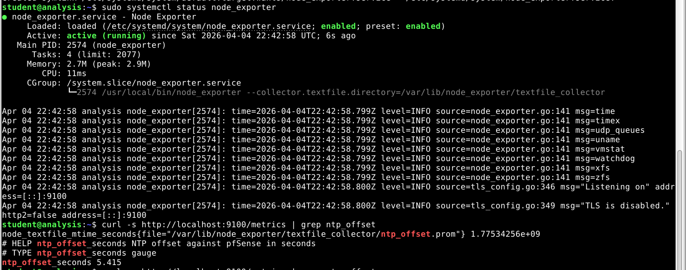](../images/img_85.png)

#### 1.11 – Targets in prometheus.yml ergänzen

Auf der MonitoringVM (`192.168.10.20`):

```bash
sudo nano /etc/prometheus/prometheus.yml
```

Node Exporter Target ergänzen:

```yaml
        - 192.168.10.22:9100   # AnalysisVM
```

Blackbox-Exporter Job ergänzen:

```yaml
  - job_name: 'blackbox'
    metrics_path: /probe
    params:
      module: [icmp_check]
    static_configs:
      - targets:
        - 192.168.10.2    # pfSense
        - 192.168.10.20   # MonitoringVM
        - 192.168.10.21   # CaptureVM
    relabel_configs:
      - source_labels: [__address__]
        target_label: __param_target
      - source_labels: [__param_target]
        target_label: instance
      - target_label: __address__
        replacement: 192.168.10.22:9115

  - job_name: 'blackbox_dns'
    metrics_path: /probe
    params:
      module: [dns_check]
    static_configs:
      - targets:
        - 192.168.10.2    # pfSense DNS
    relabel_configs:
      - source_labels: [__address__]
        target_label: __param_target
      - source_labels: [__param_target]
        target_label: instance
      - target_label: __address__
        replacement: 192.168.10.22:9115
```

> Der blackbox_exporter läuft auf der AnalysisVM auf Port 9115. Prometheus fragt ihn nicht direkt ab – stattdessen übergibt Prometheus per relabel_configs das eigentliche Ziel als Parameter, und der blackbox_exporter führt die Messung stellvertretend durch. __address__ wird dabei umgeschrieben auf 192.168.10.22:9115, damit alle Probe-Requests über die AnalysisVM laufen.

[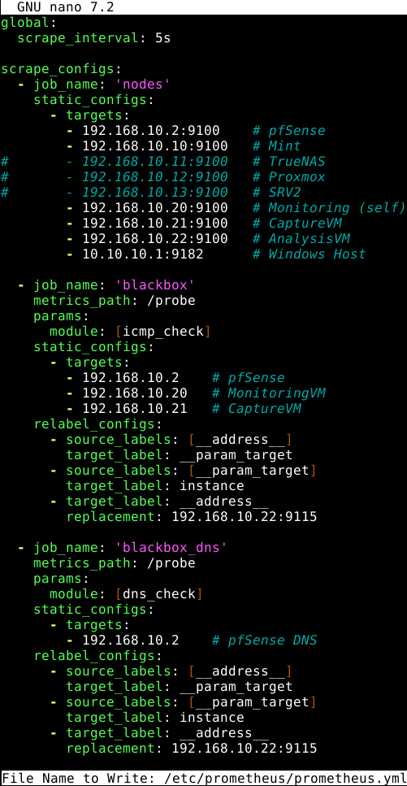](../images/img_86.png)

```bash
sudo systemctl restart prometheus
```

Funktionsnachweis: `http://192.168.10.20:9090/targets` → alle AnalysisVM-Targets `State: UP`.

[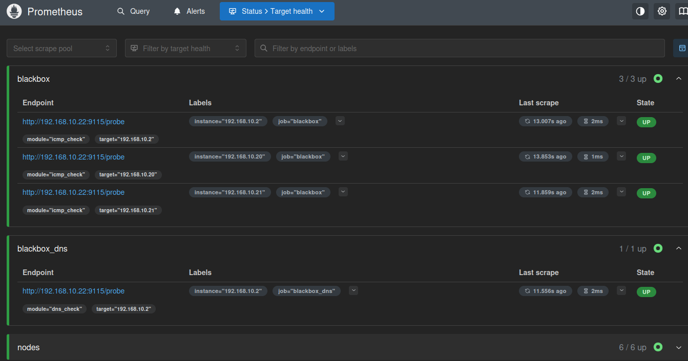](../images/img_87.png)

#### 1.12 – Firewall-Regel: Internet-Zugang blockieren

**Firewall → Rules → LAN → ↑ Add**

| Feld | Wert |
| --- | --- |
| Action | Block |
| Interface | LAN |
| Protocol | any |
| Source | `192.168.10.22` |
| Destination | `!192.168.10.0/24` |
| Description | Block Analysis-VM to Internet |

Die Firewall-Regel entspricht der bereits in `07-monitoring.md` angelegten `Block Monitoring-VM to Internet`. Der Kopieren-Button kann genutzt werden; `Source-IP` und `Description` müssen angepasst werden.

→ **Save** → **Apply Changes**


#### 1.13 – Grafana Dashboard
 
In Grafana (`http://192.168.10.20:3000`) → Dashboards → New → Add visualization.
 
##### Panel 1 – NTP Offset
 
Rechts unten auf **Code** umschalten, Query eingeben:
 
[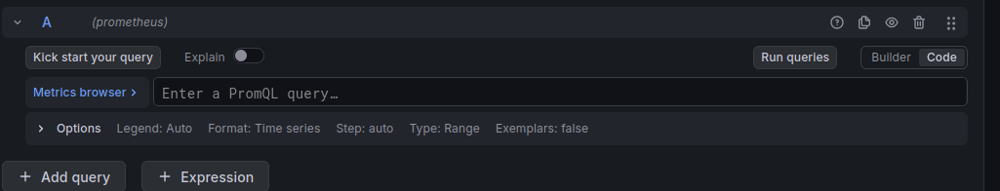](../images/img_88.png)
 
```promql
ntp_offset_seconds{job="nodes"}
```
 
→ **Run queries**
 
Rechte Sidebar:
- **Title:** `NTP Offset`
- **Standard options → Unit:** `milliseconds (ms)`
- **Standard options → Min:** `0`
- **Standard options → Max:** `0.01`
 
[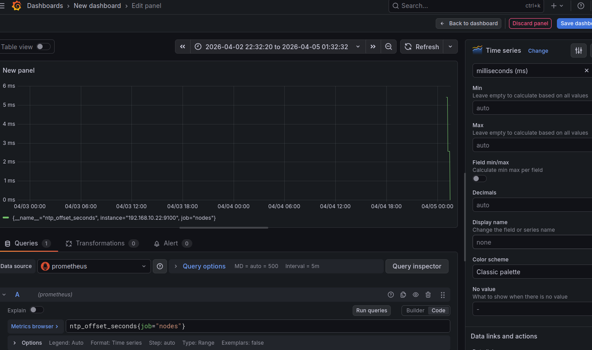](../images/img_89.png)
 
→ **Save dashboard** → Title: `NTP Monitoring` → **Save**
 
[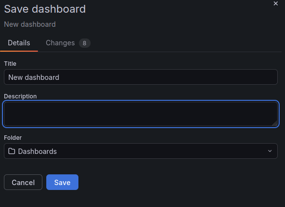](../images/img_90.png)
 
---
 
##### Panel 2 – NTP Drift (absolut)
 
Im Dashboard oben rechts → **Add → Visualization → prometheus**
 
Rechts unten auf **Code** umschalten, Query eingeben:
 
```promql
abs(ntp_offset_seconds{job="nodes"})
```
 
→ **Run queries**
 
Rechte Sidebar:
- **Title:** `NTP Drift (absolut)`
- **Standard options → Unit:** `milliseconds (ms)`
- **Standard options → Min:** `0`
- **Standard options → Max:** `0.01`
 
[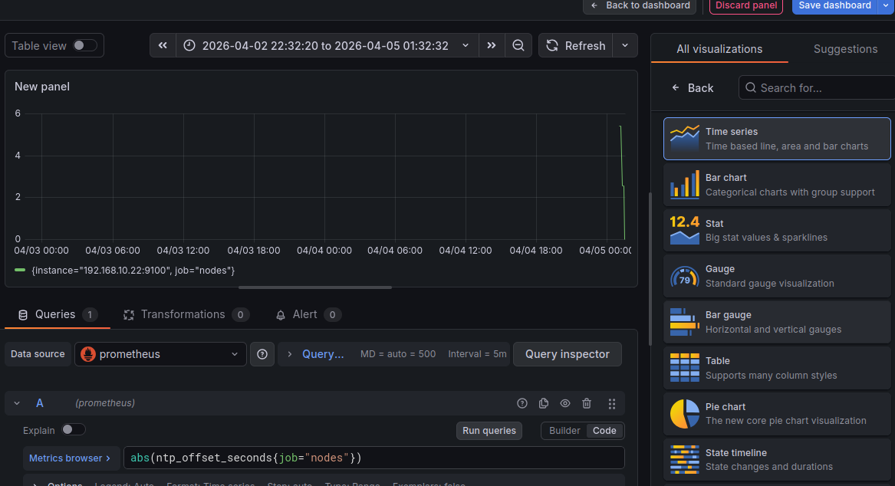](../images/img_91.png)
 
→ **Save dashboard**
 
---
 
##### Panel 3 – DNS Response Time
 
Im Dashboard oben rechts → **Add → Visualization → prometheus**
 
Visualisierungstyp: **Time series**
 
Rechts unten auf **Code** umschalten, Query eingeben:
 
```promql
probe_duration_seconds{job="blackbox_dns"} * 1000
```
 
→ **Run queries**
 
Rechte Sidebar:
- **Title:** `DNS Response Time`
- **Standard options → Unit:** `milliseconds (ms)`
 
→ **Save dashboard**
 
---
 
##### Panel 4 – DNS Availability
 
Im Dashboard oben rechts → **Add → Visualization → prometheus**
 
Visualisierungstyp: **Gauge**
 
Rechts unten auf **Code** umschalten, Query eingeben:
 
```promql
probe_success{job="blackbox_dns"}
```
 
→ **Run queries**
 
Rechte Sidebar:
- **Title:** `DNS Availability`
- **Standard options → Unit:** `short`
- **Standard options → Min:** `0` / **Max:** `1`
- **Value mappings:** `0 → Fehler`, `1 → OK`
- **Thresholds:** `0` → rot, `1` → grün
 
→ **Save dashboard** → Title: `DNS Monitoring` → **Save**
 
[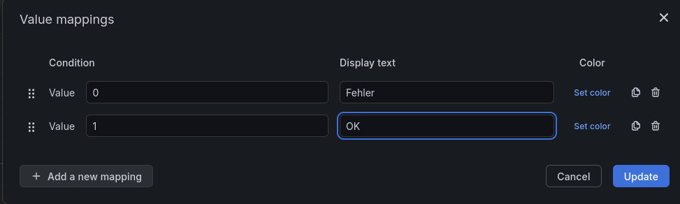](../images/img_94.png)
 
[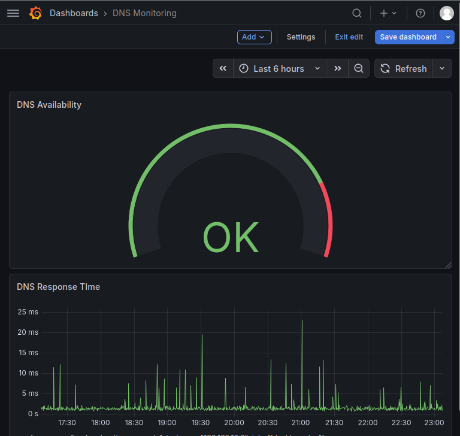](../images/img_95.png)
 
---
 
[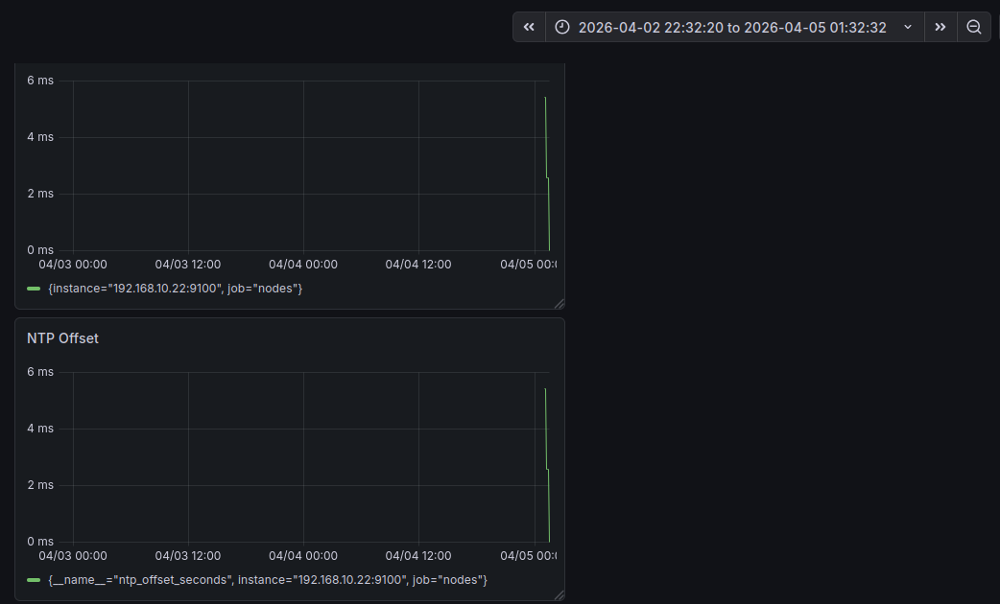](../images/img_92.png)
 
Erster Funktionsnachweis nach VM-Start: Beide Panels zeigen ausschließlich den initialen Sync-Spike bei 04/05 00:00 – dem Zeitpunkt, an dem die AnalysisVM zum ersten Mal NTP-Kontakt zu pfSense aufnahm. Davor keine Daten, danach stabil bei 0.
 
[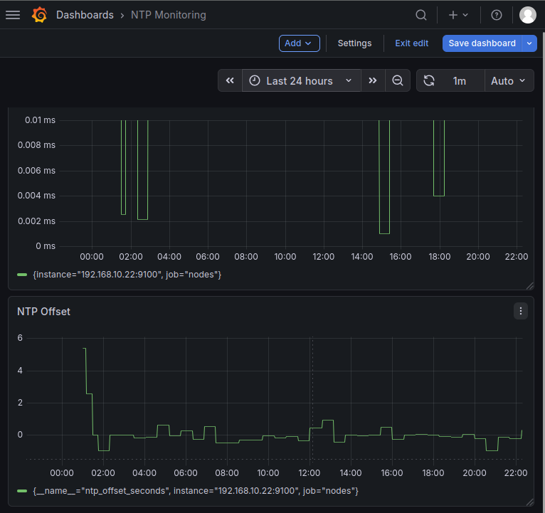](../images/img_93.png)
 
Positiver Wert → lokale Uhr geht vor (ist schneller als der NTP-Server)
Negativer Wert → lokale Uhr geht nach (ist langsamer als der NTP-Server)

Nach knapp 24 Stunden zeigt das `NTP Monitoring` Dashboard zwei komplementäre Perspektiven auf dieselbe Datenquelle. `NTP Drift (absolut)` (oben) visualisiert ausschließlich aktive Korrekturereignisse von `systemd-timesyncd` – Lücken bedeuten Stabilität, nicht fehlende Daten. `NTP Offset` (unten) zeigt die kontinuierliche Abweichung: der initiale Spike bei VM-Start ist der erste Sync, danach pendelt der Wert stabil um 0. Beide Panels zusammen belegen, dass pfSense als NTP-Quelle die AnalysisVM zuverlässig synchronisiert hält.
 
---
 
### Ausblick
 
Dieses Kapitel hat die Messmethode validiert, kein Präzisionsmesswerkzeug eingeführt. `timedatectl timesync-status` liefert ausreichend Daten um den Pfad – Script, Timer, Textfile, node_exporter, Prometheus, Grafana – end-to-end zu beweisen. Für belastbare Aussagen werden andere Tools benötigt.